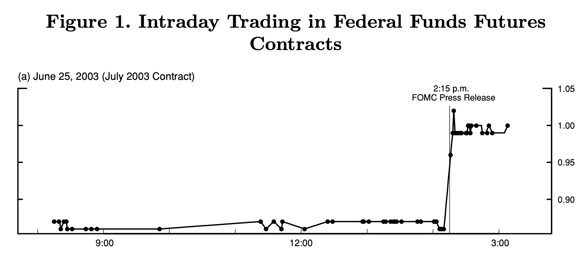

# Local projection methods {#Projections}

## Projection Methods

Consider the infinite MA representation of $y_t$ (Eq. \@ref(eq:InfMA)):
$$
y_t = \mu + \sum_{h=0}^\infty \Psi_{h} \eta_{t-h}.
$$
As seen in Section \@ref(IRFSVARMA), the entries $(i,j)$ of the sequence of the $\Psi_h$ matrices define the IRF of $\eta_{j,t}$ on $y_{i,t}$.

Assume that you observe $\eta_{j,t}$, then a consistent estimate of $\Psi_{i,j,h}$ is simply obtained by the OLS regression of $y_{i,t+h}$ on $\eta_{j,t}$:
\begin{equation}
y_{i,t+h} = \mu_i + \Psi_{i,j,h}\eta_{j,t} + u_{i,j,t+h}.(\#eq:OLS1)
\end{equation}
Because the residuals $u_{i,j,t+h}$ are autocorrelated (for $h>0$), estimates of the covariance of the OLS estimators of the $\Psi_{i,j,h}$ then have to be based on robust estimators (e.g. Newey-West, see Eq. \@ref(eq:NW)). This is the core idea of the **local projection approach** proposed by @Jorda_2005.

Now, how to proceed in the (usual) case where $\eta_{j,t}$ is not observed? We consider two situations.

**Situation A: Without IV**

This corresponds to the original @Jorda_2005's approach. 

Assume that the structural shock of interest ($\eta_{1,t}$, say) can be consistently obtained as the residual of a regression of a variable $x_t$ on a set of control variables $w_t$ independent from $\eta_{1,t}$:
\begin{equation}
\eta_{1,t} = x_t - \mathbb{E}(x_t|w_t),(\#eq:xetaw)
\end{equation}
where $\mathbb{E}(x_t|w_t)$ is affine in $w_t$ and where $w_t$ is an affine transformation of $\eta_{2:n,t}$ and of past shocks $\eta_{t-1},\eta_{t-2},\dots$.

Eq. \@ref(eq:xetaw) implies that, conditional on $w_t$, the additional knowledge of $x_t$ is useful only when it comes to forecast something that depends on $\eta_{1,t}$. Hence, given that $u_{i,1,t+h}$ (see Eq. \@ref(eq:OLS1)) is independent from $\eta_{1,t}$ (it depends on  $\eta_{t+h},\dots,\eta_{t+1},\color{blue}{\eta_{2:n,t}},\eta_{t-1},\eta_{t-2},\dots$), it comes that
$$
\mathbb{E}(u_{i,1,t+h}|x_t,w_t)= \mathbb{E}(u_{i,1,t+h}|w_t).
$$
This is the *conditional mean independence* case.

Let's rewrite Eq. \@ref(eq:OLS1) as follows:
\begin{eqnarray*}
y_{i,t+h} &=& \mu_i + \Psi_{i,1,h}\eta_{1,t} + u_{i,1,t+h}\\
&=&  \mu_i + \Psi_{i,1,h}x_t  \color{blue}{-\Psi_{i,1,h}\mathbb{E}(x_t|w_t) + u_{i,1,t+h}},
\end{eqnarray*}

What precedes implies that the expectation of the blue term, conditional on $x_t$ and $w_t$, is linear in $w_t$. Standard results in the conditional mean independence case imply that the regression of $y_{i,t+h}$ on $x_t$, controlling for $w_t$, provides a consistent estimate of $\Psi_{i,1,h}$:
\begin{equation}
y_{i,t+h} = \alpha_i + \Psi_{i,1,h}x_t + \beta'w_t + v_{i,t+h}.
\end{equation}

This is for instance consistent with the case where $[\Delta GDP_t, \pi_t,i_t]'$ follows a VAR(1) and the monetary-policy shock do not contemporaneously affect $\Delta GDP_t$ and $\pi_t$.

The IRFs can be estimated by LP, taking $x_t = i_t$ and $w_t = [\Delta GDP_t,\pi_t,\Delta GDP_{t-1}, \pi_{t-1},i_{t-1}]'$.

This approach closely relates to the SVAR Cholesky-based identification approach. Specifically, if $w_t = [{\color{blue}y_{1,t},\dots,y_{k-1,t}}, y_{t-1}',\dots,y_{t-p}']'$, with $k\le n$, and $x_t = y_{k,t}$, then this approach corresponds, for $h=0$, to the SVAR($p$) Cholesky-based IRF (focusing on the responses to the $k^{th}$ structural shock). However, the two approaches differ for $h>0$, because the LP methodology does not assumes a VAR dynamics for $y_t$.[^FootnoteIteratedFcst]

[^FootnoteIteratedFcst]: This is reminiscent of the distinction betweem direct forecasting --based on regressions of $y_{t+h}$ on $\{y_t,y_{t-1},\dots\}$-- and iterated forecasting --based on a recursive model where $y_{t+1} = g(y_t,y_{t-1},\dots)+\varepsilon_{t+1}$, see @Marcellino_et_al_2006. 


**Situation B: IV approach**

Consider now that we have a valid instrument $z_t$ for $\eta_{1,t}$ (with $\mathbb{E}(z_t)=0$). That is:
\begin{equation}
\left\{
\begin{array}{llll}
(IV.i) & \mathbb{E}(z_t \eta_{1,t}) &\ne 0 & \mbox{(relevance condition)} \\
(IV.ii) & \mathbb{E}(z_t \eta_{j,t}) &= 0 \quad \mbox{for } j>1 & \mbox{(exogeneity condition)}
\end{array}\right.(\#eq:IV1)
\end{equation}
The instrument $z_t$ can be used to identify the structural shock. Eq. \@ref(eq:IV1) implies that there exist $\rho \ne 0$ and a mean-zero variable $\xi_t$ such that:
$$
\eta_{1,t} = \rho z_t + \xi_t,
$$
where $\xi_t$ is correlated neither to $z_t$, nor to $\eta_{j,t}$, $j\ge2$.

:::{.proof}
Define $\rho = \frac{\mathbb{E}(\eta_{1,t}z_t)}{\mathbb{V}ar(z_t)}$ and $\xi_t = \eta_{1,t} - \rho z_t$. It is easily seen that $\xi_t$ satisfies the moment restrictions given above.
:::

@Ramey_2016_NBER reviews the different approaches employed to construct monetary policy-shocks (the two main approaches are presented in \@ref(exm:HighFreq) and \@ref(exm:RomerRomer) below). She has also collected time series of such shocks, see [her website](https://econweb.ucsd.edu/~vramey/research.html#mon).

:::{.example #HighFreq name="Identification of Monetary-Policy Shocks Based on High-Frequency Data"}

Instruments for monetary-policy shocks can be extracted from high-frequency market data associated with interest-rate products.

The quotes of all interest-rate-related financial products are sensitive to monetary-policy announcements. That is because these quotes mainly depends on investors' expectations regarding future short-term rates: $\mathbb{E}_t(i_{t+s})$. Typically, if agents were risk-neutral, the maturity-$h$ interest rate would approximatively be given by:
$$
i_{t,h} \approx \mathbb{E}_t\left(\frac{1}{h}\int_{0}^{h} i_{t+s} ds\right) = \frac{1}{h}\int_{0}^{h} \mathbb{E}_t\left(i_{t+s}\right) ds.
$$
In general, changes in $\mathbb{E}_t(i_{t+s})$, for $s>0$, can be affected by all types of shocks that may trigger a reaction by the central bank.

However, if a MP announcement takes place between $t$ and $t+\epsilon$, then most of $\mathbb{E}_{t+\epsilon}(i_{t+s})-\mathbb{E}_t(i_{t+s})$ is to be attributed to the MP shock (see Figure \@ref(fig:HighFreq), from @Gurkaynak_et_al_2005). Hence, a monthly time series of MP shocks can be obtained by summing, over each month, the changes $i_{t+ \epsilon,h} - i_{t,h}$ associated with a given interest rate (T-bills, futures, swaps) and a given maturity $h$.

See among others: @KUTTNER2001523, @Cochrane_Piazzesi_2002,@Gurkaynak_et_al_2005, @Piazzesi_Swanson_2008, @Gertler_Karadi_2015.


```{r HighFreq, fig.align = 'left-aligned', out.width = "95%", fig.cap = "Source: Gurkaynak, Sack and Swanson (2005). Transaction rates of Federal funds futures on June 25, 2003, day on which a regularly scheduled FOMC meeting was scheduled. At 2:15 p.m., the FOMC announced that it was lowering its target for the federal funds rate from 1.25\\% to 1\\%, while many market participants were expecting a 50 bp cut. This shows that (i) financial markets seem to fully adjust to the policy action within just a few minutes and (ii) the federal funds rate surprise is not necessarily in the same direction as the federal funds rate action itself.", echo=FALSE}

```

:::

:::{.example #RomerRomer name="Identification of Monetary-Policy Shocks Based on the Narrative Approach"}

@Romer_Romer_2004 propose a two-step approach:

a. derive a series for Federal Reserve intentions for the  federal  funds  rate (the explicit target of the Fed)  around  FOMC  meetings,
b. control for Federal Reserve forecasts.

This gives a measure of intended monetary policy actions not driven by information about future economic developments.
a. "intentions" are measured as a combination of narrative and quantitative evidence. Sources: (among others) Minutes of FOMC and "Blue Books".
b. Controls = variables spanning the information the Federal Reserve has about future developments. Data: Federal Reserve's internal forecasts (inflation, real output and unemployment), "Greenbook's forecasts" -- usually issued 6 days before the FOMC meeting.

The shock measure is the residual series in the linear regression of (a) on (b).
:::


There are two main IV approaches to estimate IRFs see @Stock_Watson_2018:

a. The LP-IV approach, where $y_t$'s DGP is left unspecified,
b. The SVAR-IV approach.

The LP-IV approach is based on a set of IV regressions (for each variable of interest, one for each forecast horizon). The SVAR-IV approach is based on IV regressions of VAR innovations only (one for each series of VAR innovations).

If the VAR adequately captures the DGP, then the IV-SVAR is optimal for all horizons. However, if the VAR is misspecified, then specification errors are compounded at each horizon and a local projection method would lead to better results.


**Situation B.1: SVAR-IV approach**

Assume you have consistent estimates of $\varepsilon_t = B\eta_t$, these estimates ($\hat\varepsilon_{t}$) coming from the estimation of a VAR model. You have, for $i \in \{1,\dots,n\}$:
\begin{eqnarray}
\varepsilon_{i,t} &=& b_{i,1} \eta_{1,t} + u_{i,t} (\#eq:eps_rho)\\
&=& b_{i,1} \rho z_t + \underbrace{b_{i,1}\xi_t + u_{i,t}}_{\perp z_t}. \nonumber
\end{eqnarray}
($u_{i,t}$ is a linear combination of the $\eta_{j,t}$'s, $j\ge2$).

Hence, up to a multiplicative factor ($\rho$), the (OLS) regressions of the $\hat\varepsilon_{i,t}$'s on $z_t$ provide consistent estimates of the $b_{i,1}$'s.

Combined with the estimated VAR (the $\Phi_k$ matrices), this provides consistent estimates of the IRFs of $\eta_{1,t}$ on $y_t$, though up to a multiplicative factor. This scale ambiguity can be solved by rescaling the structural shock ("unit-effect normalisation", see @Stock_Watson_2018). Let us consider $\tilde\eta_{1,t}=b_{1,1}\eta_{1,t}$; by construction, $\tilde\eta_{1,t}$ has a one-unit contemporaneous effect on $y_{1,t}$. Denoting by $\tilde{B}_{i,1}$ the contemporaneous impact of $\tilde\eta_{1,t}$, we get:
$$
\tilde{B}_{1} = \frac{1}{b_{1,1}} {B}_{1},
$$
where $B_{1}$ denotes the $1^{st}$ column of $B$ and $\tilde{B}_{1}=[1,\tilde{B}_{2,1},\dots,\tilde{B}_{n,1}]'$.

Eq. \@ref(eq:eps_rho) gives:
\begin{eqnarray*}
\varepsilon_{1,t} &=& \tilde\eta_{1,t} + u_{1,t}\\
\varepsilon_{i,t} &=& \tilde{B}_{i,1} \tilde\eta_{1,t} + u_{i,t}.
\end{eqnarray*}
This suggests that $\tilde{B}_{i,1}$ can be estimated by regressing $\varepsilon_{i,t}$ on $\varepsilon_{1,t}$, using $z_t$ as an instrument.

What about inference? Once cannot use the usual TSLS standard deviations because the $\varepsilon_{i,t}$'s are not directly observed. Bootstrap procedures can be resorted to. @Stock_Watson_2018 propose, in particular, a Gaussian parametric bootstrap:

Assume you have estimated $\{\widehat{\Phi}_1,\dots,\widehat{\Phi}_p,\widehat{B}_1\}$ using the SVAR-IV approach based on a size-$T$ sample. Generate $N$ (where $N$ is large) size-$T$ samples from the following VAR:
$$
\left[
\begin{array}{cc}
\widehat{\Phi}(L) & 0 \\
0 & \widehat{\rho}(L)
\end{array}
\right]
\left[
\begin{array}{c}
y_t \\
z_t
\end{array}
\right] =
\left[
\begin{array}{c}
\varepsilon_t \\
e_t
\end{array}
\right],
$$
$$
\mbox{where} \quad \left[
\begin{array}{c}
\varepsilon_t \\
e_t
\end{array}
\right]\sim \, i.i.d.\,\mathcal{N}\left(\left[\begin{array}{c}0\\0\end{array}\right],
\left[\begin{array}{cc}
\Omega & S'_{\varepsilon,e}\\
S_{\varepsilon,e}& \sigma^2_{e}
\end{array}\right]
\right),
$$
where $\widehat{\rho}(L)$ and $\sigma^2_{e}$ result from the estimation of an AR process for $z_t$, and where $\Omega$ and $S_{\varepsilon,e}$ are sample covariances for the VAR/AR residuals.

For each simulated sample (of $\tilde{y}_t$ and $\tilde{z}_t$, say), estimate $\{\widetilde{\widehat{\Phi}}_1,\dots,\widetilde{\widehat{\Phi}}_p,\widetilde{\widehat{B}}_1\}$ and associated $\widetilde{\Psi}_{i,1,h}$. This provides e.g. a sequence of $N$ estimates of $\Psi_{i,1,h}$, from which quantiles and conf. intervals can be deduced.


```{r essaiIV0, warning=FALSE,message=FALSE, fig.align = 'left-aligned', out.width = "95%", fig.cap = "Gertler-Karadi monthly shocks, fed funds futures 3 months."}
# Load vars package:
library(vars)
library(AEC)
data("USmonthly")
First.date <- "1990-05-01"
Last.date <- "2012-6-01"
indic.first <- which(USmonthly$DATES==First.date)
indic.last  <- which(USmonthly$DATES==Last.date)
USmonthly   <- USmonthly[indic.first:indic.last,]
shock.name <- "FF4_TC" #"FF4_TC", "ED2_TC", "ff1_vr", "rrshock83b"
indic.shock.name <- which(names(USmonthly)==shock.name)
Z <- matrix(USmonthly[,indic.shock.name],ncol=1)
par(plt=c(.1,.95,.1,.95))
plot(USmonthly$DATES,Z,type="l",xlab="",ylab="",lwd=2)
```


```{r essaiIV1, warning=FALSE,message=FALSE, fig.align = 'left-aligned', out.width = "95%", fig.cap = "Reponses to a monetary-policy shock, SVAR-IV approach."}
considered.variables <- c("GS1","LIP","LCPI","EBP")
y <- as.matrix(USmonthly[,considered.variables])
n <- length(considered.variables)
colnames(y) <- considered.variables
par(plt=c(.15,.95,.15,.8))
res.svar.iv <- 
  svar.iv(y,Z,p = 4,names.of.variables=considered.variables,
          nb.periods.IRF = 20,
          z.AR.order=1, 
          nb.bootstrap.replications = 100, 
          confidence.interval = 0.90,
          indic.plot=1)
```


**Situation B.2: LP-IV**

If you do not want to posit a VAR-type dynamics for $y_t$ --e.g. because you suspect that the true generating model may be a non-invertible VARMA model-- you can directly proceed by IV-projection methods to obtain the $\tilde\Psi_{i,1,h}\equiv \Psi_{i,1,h}/b_{1,1}$ (that are the IRFs of $\tilde\eta_{1,t}$ on $y_{i,t}$).

However, Assumptions (IV.i) and (IV.ii) (Eq. \@ref(eq:IV1)) have to be complemented with (IV.iii):
\begin{equation*}
\begin{array}{llll}
(IV.iii) & \mathbb{E}(z_t \eta_{j,t+h}) &= 0 \, \mbox{ for } h \ne 0 & \mbox{(lead-lag exogeneity)}
\end{array}
\end{equation*}

When (IV.i), (IV.ii) and (IV.iii) are satisfied, $\tilde\Psi_{i,1,h}$ can be estimated by regressing $y_{i,t+h}$ on $y_{1,t}$, using $z_t$ as an instrument, i.e. by considering the TSLS estimation of:
\begin{equation}
y_{i,t+h} = \alpha_i + \tilde\Psi_{i,1,h}y_{1,t} + \nu_{i,t+h},(\#eq:regIV1)
\end{equation}
where $\nu_{i,t+h}$ is correlated to $y_{1,t}$, but not to $z_t$.

We have indeed:
\begin{eqnarray*}
y_{1,t} &=& \alpha_1 + \tilde\eta_{1,t} + v_{1,t}\\
y_{i,t+h} &=& \alpha_i + \tilde\Psi_{i,1,h}\tilde\eta_{1,t} + v_{i,t+h},
\end{eqnarray*}
where the $v_{i,t+h}$'s are uncorrelated to $z_t$ under (IV.i), (IV.ii) and (IV.iii).

Note again that, for $h>0$, the $v_{i,t+h}$ (and $\nu_{i,t+h}$) are auto-correlated. Newey-West corrections therefore have to be used to compute std errors of the $\tilde\Psi_{i,1,h}$'s estimates. 

Consider the linear regression:
$$
\bv{Y} = \bv{X}\boldsymbol\beta + \boldsymbol\varepsilon,
$$
where $\mathbb{E}(\boldsymbol\varepsilon)=0$, but where the explicative variables $\bv{X}$ are supposed to be correlated to the residuals $\boldsymbol\varepsilon$. 

Moreover, the $\boldsymbol\varepsilon$ are supposed to be possibly heteroskedastic and auto-correlated.

We consider the instruments $\bv{Z}$, with $\mathbb{E}(\bv{X}'\bv{Z}) \ne 0$ but $\mathbb{E}(\boldsymbol\varepsilon'\bv{Z}) = 0$.

The IV estimator of $\boldsymbol\beta$ is obtained by regressing $\hat{\bv{Y}}$ on $\hat{\bv{X}}$, where $\hat{\bv{Y}}$ and $\hat{\bv{X}}$ are the respective residuals of the regressions of $\bv{Y}$ and $\bv{X}$ on $\bv{Z}$.
\begin{eqnarray*}
\bv{b}_{iv} &=& [\bv{X}'\bv{Z}(\bv{Z}'\bv{Z})^{-1}\bv{Z}'\bv{X}]^{-1}\bv{X}'\bv{Z}(\bv{Z}'\bv{Z})^{-1}\bv{Z}'\bv{Y}\\
\bv{b}_{iv} &=& \boldsymbol\beta + \frac{1}{\sqrt{T}}\underbrace{T[\bv{X}'\bv{Z}(\bv{Z}'\bv{Z})^{-1}\bv{Z}'\bv{X}]^{-1}\bv{X}'\bv{Z}(\bv{Z}'\bv{Z})^{-1}}_{=Q(\bv{X},\bv{Z}) \overset{p}{\rightarrow} \bv{Q}_{xz}}\underbrace{\sqrt{T}\left(\frac{1}{T}\bv{Z}'\boldsymbol\varepsilon\right)}_{\overset{d}{\rightarrow} \mathcal{N}(0,S)},
\end{eqnarray*}
where $\bv{S}$ is the long-run variance of $\bv{z}_t\varepsilon_t$ (see next slide).

The asymptotic covariance matrix of $\sqrt{T}\bv{b}_{iv}$ is $\bv{Q}_{xz} \bv{S} \bv{Q}_{xz}'$.

The covariance matrix of $\bv{b}_{iv}$ can be approximated by $\frac{1}{T}Q(\bv{X},\bv{Z})\hat{\bv{S}}Q(\bv{X},\bv{Z})'$ where $\hat{\bv{S}}$ is the Newey-West estimator of $\bv{S}$ (see Eq. \@ref(eq:NW))


(IV.iii) is usually not restrictive for $h>0$ ($z_t$ is usually not affected by future shocks). By contrast, it may be restrictive for $h<0$. This can be solved by adding controls in Regression \@ref(eq:regIV1). These controls should span the space of $\{\eta_{t-1},\eta_{t-2},\dots\}$.

If $z_t$ is  suspected to be correlated to past values of $\eta_{1,t}$ but not to the $\eta_{j,t}$'s, $j>1$, then one can add lags of $z_t$ as controls (method e.g. advocated by Ramey, 2016, p.108, considering the instrument by @Gertler_Karadi_2015).

In the general case, one can use lags of $y_t$ as controls. Note that, even if (IV.iii) holds, adding controls may reduce the variance of the regression error.

As noted by @Stock_Watson_2018, the relevant variance is the long-run variance of the instrument-times-error term. They also recommend (p.926) using leads and lags of $z_t$ to improve efficiency.


```{r essaiIV, warning=FALSE,message=FALSE, fig.align = 'left-aligned', out.width = "95%", fig.cap = "Reponses to a monetary-policy shock, LP-IV approach.",eval=FALSE}
res.LP.IV <- make.LPIV.irf(y,Z,
                           nb.periods.IRF = 20,
                           nb.lags.Y.4.control=4,
                           nb.lags.Z.4.control=4,
                           indic.plot = 1, # Plots are displayed if = 1.
                           confidence.interval = 0.90)
```


