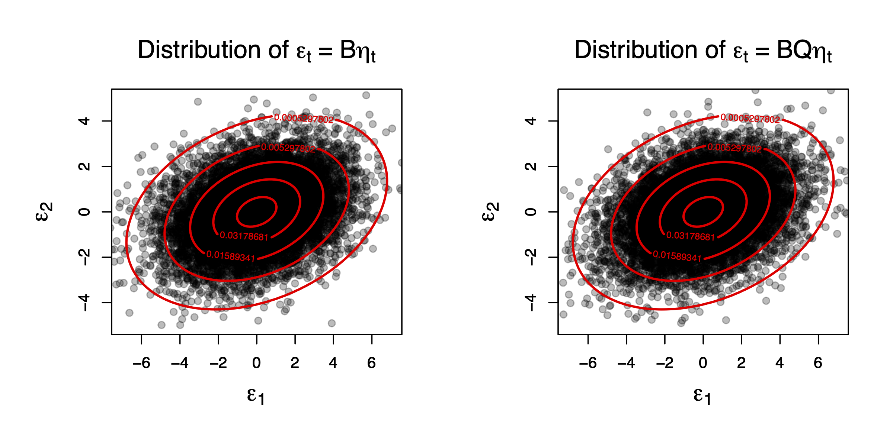
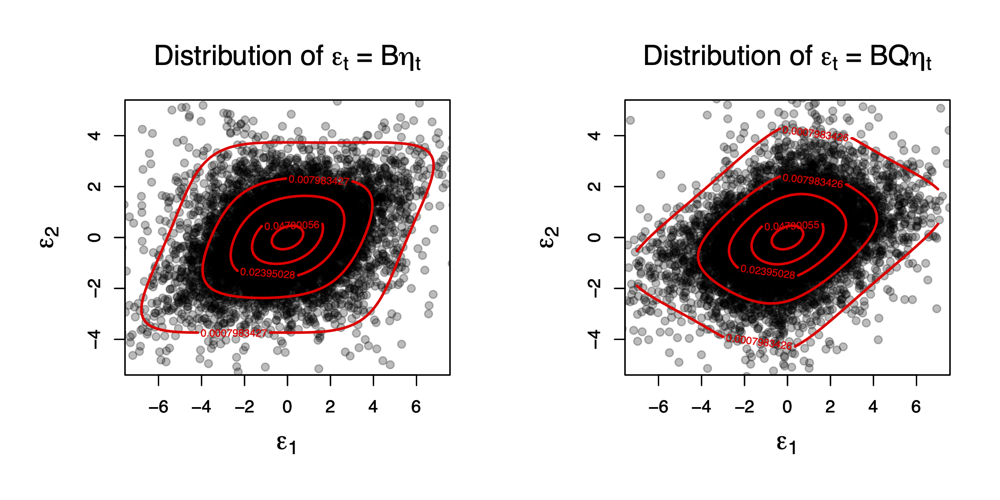
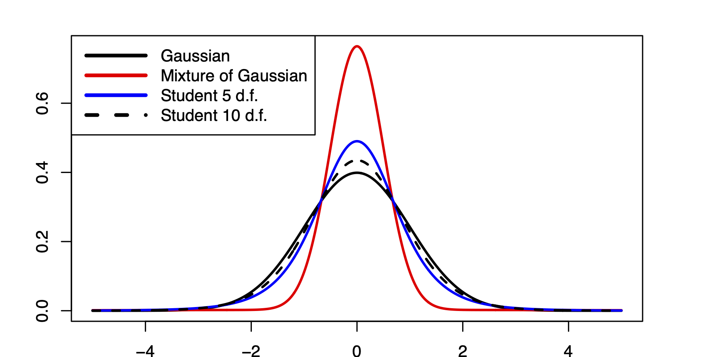
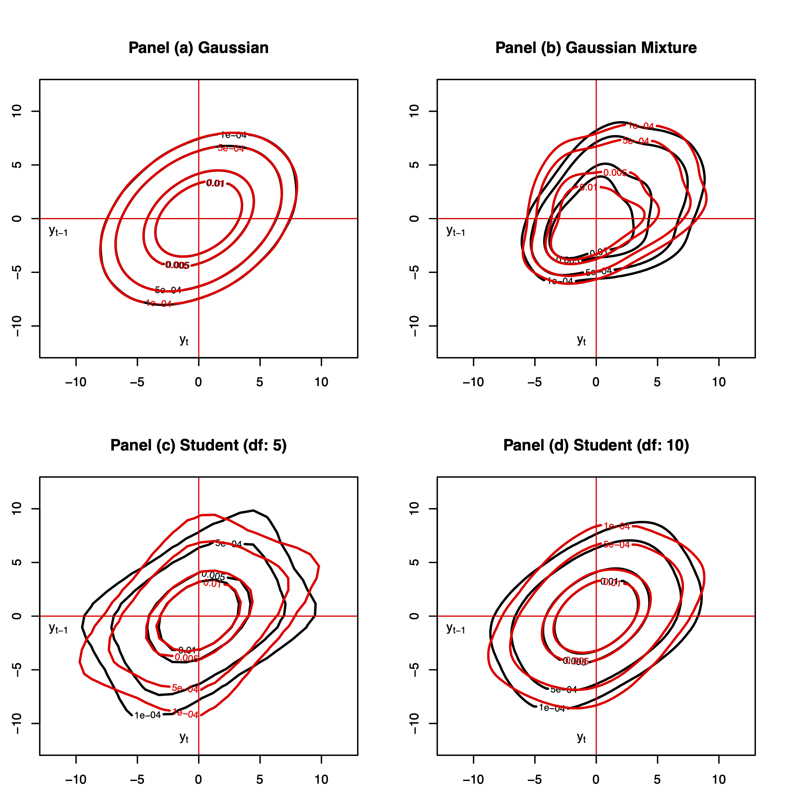

# Identification based on non-normality of the shocks {#NonGaussian}

## Intuition

In this section, we show that the non-identification of the structural shocks ($\eta_t$) is specific to the Gaussian case. We propose consistent estimation approaches for SVAR in the context of non-Gaussian shocks.

<!-- In a first part, we focus on non-Gaussian SVAR models; in a second part, we discuss the case of non-Gaussian SVARMA models. -->

We have seen in what precedes that we cannot identify $B$ based on first and second moments only. Since a Gaussian distribution is perfectly determined by the first two moments, it comes that one cannot achieve identification when the structural shocks are Gaussian. That is, even if we observe an infinite number of i.i.d. $B \eta_t$, we cannot recover $B$ is the $\eta_t$'s are Gaussian.

Indeed, if $\eta_t \sim \mathcal{N}(0,Id)$, then the distribution of $\varepsilon_t \equiv B \eta_t$ is $\mathcal{N}(0,BB')$. Hence $\Omega = B B'$ is observed (in the population), but for any orthogonal matrix $Q$ (i.e. $QQ'=Id$), we also have $BQ \eta_t \sim \mathcal{N}(0,\Omega)$.

To illustrate, consider the following bivariate Gaussian situations, with $\Theta_1=0$):

$\left[\begin{array}{c}\eta_{1,t}\\ \eta_{2,t}\end{array}\right]\sim \mathcal{N}(0,Id)$, with 
$B = \left[\begin{array}{cc}
1 & 2 \\
-1 & 1
\end{array}\right]$ and
$Q = \left[\begin{array}{cc}
\cos(\pi/3) & -\sin(\pi/3) \\
\sin(\pi/3) & \cos(\pi/3)
\end{array}\right]$ (rotation).

Figure \@ref(fig:preMadeFigureICA) shows that the distributions of $B \eta_t$ and of $BQ\eta_t$ are identical. However, the impulse response functions associated with one of the other impulse matrix ($B$ or $BQ$) are different. This is illustrated by Figure \@ref(fig:preMadeFigureICA2), that shows the IRFs associated with two identical models (defined by Eq. \@ref(eq:VARMA111)), the only difference being the impulse matrix ($B$ or $BQ$).


```{r simulGaussian, eval=FALSE, echo=FALSE}
theta.angle <- pi/3
Q <- matrix(c(cos(theta.angle),sin(theta.angle),-sin(theta.angle),cos(theta.angle)),2,2)
#nb.sim <- 10^4
nb.sim <- 10^2
distri.1 <- list(type=c("gaussian"),name="Panel (a) Gaussian",name.4.table="Gaussian")
distri.2 <- list(type=c("mixt.gaussian"),mu=0,sigma=5,p=.03,name="Panel (b) Mixture of Gaussian",name.4.table="Mixture of Gaussian")
distri.3 <- list(type=c("student"),df=c(5),name="Panel (c) Student (df: 5)",name.4.table="Student (df: 5)")
distri.4 <- list(type=c("student"),df=c(10),name="Panel (d) Student (df: 10)",name.4.table="Student (df: 10)")
x.lim <- c(-7,7)
y.lim <- c(-5,5)
nb.points <- 100
x.points <- seq(x.lim[1],x.lim[2],length.out=nb.points)
y.points <- x.points
all.x <- c(matrix(x.points,nb.points,nb.points))
all.y <- c(t(matrix(x.points,nb.points,nb.points)))
eps <- cbind(all.x,all.y)
par(plt=c(.25,.9,.25,.8))
eta.1 <- simul.distri(distri.1,nb.sim)
eta.2 <- simul.distri(distri.1,nb.sim)
epsilon.C <- cbind(eta.1,eta.2) %*% t(C)
epsilon.CQ <- cbind(eta.1,eta.2) %*% t(C %*% Q)
Model$distri <- list(type=c("gaussian","gaussian"),df=c(NaN,NaN))
par(mfrow=c(1,2))
plot(epsilon.C[,1],epsilon.C[,2],pch=19,
     xlim=x.lim,ylim=y.lim,col="#00000044",
     xlab=expression(epsilon[1]),
     ylab=expression(epsilon[2]),cex.lab=1.6,cex.main=1.6,
     main=expression(paste("Distribution of ",epsilon[t]," = ",B,eta[t],sep="")))
z <- matrix(exp(g(eps,Model)),nb.points,nb.points)
par(new=TRUE)
max.z <- max(z)
levels <- c(.01,.1,.3,.6,.9)*max.z
contour(x.points,y.points,z,levels=levels,xlim=x.lim,ylim=y.lim,col="red",lwd=2)
plot(epsilon.CQ[,1],epsilon.CQ[,2],pch=19,
     xlim=x.lim,ylim=y.lim,col="#00000044",
     xlab=expression(epsilon[1]),
     ylab=expression(epsilon[2]),cex.lab=1.6,cex.main=1.6,
     main=expression(paste("Distribution of ",epsilon[t]," = ",BQ,eta[t],sep="")))
z <- matrix(exp(g(eps,Model)),nb.points,nb.points)
par(new=TRUE)
max.z <- max(z)
levels <- c(.01,.1,.3,.6,.9)*max.z
contour(x.points,y.points,z,levels=levels,xlim=x.lim,ylim=y.lim,col="red",lwd=2)
```

```{r preMadeFigureICA, fig.align = 'left-aligned', out.width = "95%", fig.cap = "This figure compares the distributions of two Gaussian bivariate vectors, $B \\eta_t$ and $BQ\\eta_t$, where $\\eta_{t} \\sim \\mathcal{N}(0,Id)$ (therefore $\\eta_{1,t}$ and $\\eta_{2,t}$ are independent), and $Q$  is an orthogonal matrix.", echo=FALSE}

```


```{r preMadeFigureICA2, fig.align = 'left-aligned', out.width = "95%", fig.cap = "This figure shows that the impulse response functions associated with an impulse matrix equal to $B$ (black line) or $BQ$ (red line) are different (even if $BB'=BQ(BQ)'$).", echo=FALSE}
library(IdSS)
nb.sim <- 12
n <- 2
Phi <- array(NaN,c(n,n,1))
Phi[,,1] <- matrix(c(.5,-.4,.3,.7),2,2)
p <- dim(Phi)[3]
Theta <- array(NaN,c(n,n,1))
Theta[,,1] <- 0*(-matrix(c(2,1,0,.5),2,2))
q <- dim(Theta)[3]
Mu <- rep(0,n)
C <- matrix(c(1,-1,2,1),2,2)
distri <- list(type=c("gaussian","gaussian"),df=c(4,4))
Model <- list(
  Mu = Mu,
  Phi = Phi,
  Theta = Theta,
  C = C,
  distri = distri
)
Y0 <- rep(0,n)
eta0 <- c(1,0)
res.sim.1C <- simul.VARMA(Model,nb.sim,Y0,eta0,indic.IRF=1)
eta0 <- c(0,1)
res.sim.2C <- simul.VARMA(Model,nb.sim,Y0,eta0,indic.IRF=1)
theta.angle <- pi/3
Q <- matrix(c(cos(theta.angle),sin(theta.angle),-sin(theta.angle),cos(theta.angle)),2,2)
Model$C <- C %*% Q
Y0 <- rep(0,n)
eta0 <- c(1,0)
res.sim.1CQ <- simul.VARMA(Model,nb.sim,Y0,eta0,indic.IRF=1)
eta0 <- c(0,1)
res.sim.2CQ <- simul.VARMA(Model,nb.sim,Y0,eta0,indic.IRF=1)
par(plt=c(.1,.95,.25,.8))
par(mfrow=c(2,2))
plot(res.sim.1C$Y[1,],las=1,
     ylim=c(-1.5,3),
     type="b",lwd=2,xlab="",ylab="",
     main=expression(paste("Response of ",y[1,"*,*",t]," to a one-unit increase in ",eta[1],sep="")))
lines(res.sim.1CQ$Y[1,],col="red",type="b",lwd=2,pch=0)
abline(h=0,col="grey",lty=3)
legend("topright",
       c(expression(paste(epsilon[t]," = ",B,eta[t],sep="")),
         expression(paste(epsilon[t]," = ",BQ,eta[t],sep=""))),
       lty=c(1,1), # gives the legend appropriate symbols (lines)
       lwd=c(3,3), # line width
       pch=c(21,22),
       pt.bg = "white",
       col=c("black","red"),
       seg.len=4,
       cex=1.3,bg="white",title="Model:")
plot(res.sim.2C$Y[1,],las=1,
     ylim=c(-1.5,3),
     type="b",lwd=2,xlab="",ylab="",
     main=expression(paste("Response of ",y[1,"*,*",t]," to a one-unit increase in ",eta[2],sep="")))
lines(res.sim.2CQ$Y[1,],col="red",type="b",lwd=2,pch=0)
abline(h=0,col="grey",lty=3)
plot(res.sim.1C$Y[2,],las=1,
     ylim=c(-1.5,2),
     type="b",lwd=2,xlab="",ylab="",
     main=expression(paste("Response of ",y[2,"*,*",t]," to a one-unit increase in ",eta[1],sep="")))
lines(res.sim.1CQ$Y[2,],col="red",type="b",lwd=2,pch=0)
abline(h=0,col="grey",lty=3)
plot(res.sim.2C$Y[2,],las=1,
     ylim=c(-1.5,2),
     type="b",lwd=2,xlab="",ylab="",
     main=expression(paste("Response of ",y[2,"*,*",t]," to a one-unit increase in ",eta[2],sep="")))
lines(res.sim.2CQ$Y[2,],col="red",type="b",lwd=2,pch=0)
abline(h=0,col="grey",lty=3)
```


Hence, in the Gaussian case, external restrictions (economic hypotheses) are needed to identify $B$ (see previous sections). But such restrictions may not be necessary if the structural shocks are not Gaussian. That is, the identification problem is very specific to normally-distributed $\eta_t$'s (@Rigobon_2003, @NORMANDIN20041217, @Lanne_Lutkepohl_2008).

To better see why this can be the case, consider again a bivariate vector of independent structural shocks   ($\eta_{1,t}$ and $\eta_{2,t}$) but, now, assume that one of them is not Gaussian any more. Specifically, assume that $\eta_{2,t}$ is drawn from a Student distribution with 5 degrees of freedom:
$\eta_{1,t} \sim \mathcal{N}(0,1)$, $\eta_{2,t} \sim t(5)$,
$B = \left[\begin{array}{cc}
1 & 2 \\
-1 & 1
\end{array}\right]$ and
$Q = \left[\begin{array}{cc}
\cos(\pi/3) & -\sin(\pi/3) \\
\sin(\pi/3) & \cos(\pi/3)
\end{array}\right]$.

Figure \@ref(fig:preMadeFigureICAGaussianStudent) shows that, in this case, $B \eta_t$ and $BQ\eta_t$ do not have the same distribution any more (in spite of the fact that, in both cases, we have $\mathbb{V}ar(\varepsilon_t)=BB'$). This opens the door to the identification of the impulse matrix ($BQ$) in the non-Gaussian case.


```{r simulGaussianStudent, eval=FALSE,echo=FALSE}
theta.angle <- pi/3
Q <- matrix(c(cos(theta.angle),sin(theta.angle),-sin(theta.angle),cos(theta.angle)),2,2)
#nb.sim <- 10^4
nb.sim <- 10^2
distri.1 <- list(type=c("gaussian"),name="Panel (a) Gaussian",name.4.table="Gaussian")
distri.2 <- list(type=c("mixt.gaussian"),mu=0,sigma=5,p=.03,name="Panel (b) Mixture of Gaussian",name.4.table="Mixture of Gaussian")
distri.3 <- list(type=c("student"),df=c(5),name="Panel (c) Student (df: 5)",name.4.table="Student (df: 5)")
distri.4 <- list(type=c("student"),df=c(10),name="Panel (d) Student (df: 10)",name.4.table="Student (df: 10)")
x.lim <- c(-7,7)
y.lim <- c(-5,5)
nb.points <- 100
x.points <- seq(x.lim[1],x.lim[2],length.out=nb.points)
y.points <- x.points
all.x <- c(matrix(x.points,nb.points,nb.points))
all.y <- c(t(matrix(x.points,nb.points,nb.points)))
eps <- cbind(all.x,all.y)
par(plt=c(.25,.9,.25,.8))
eta.1 <- simul.distri(distri.1,nb.sim)
eta.2 <- simul.distri(distri.3,nb.sim)
epsilon.C <- cbind(eta.1,eta.2) %*% t(C)
epsilon.CQ <- cbind(eta.1,eta.2) %*% t(C %*% Q)
Model$distri <- list(type=c("gaussian","student"),df=c(NaN,5))
par(mfrow=c(1,2))
plot(epsilon.C[,1],epsilon.C[,2],pch=19,
     xlim=x.lim,ylim=y.lim,col="#00000044",
     xlab=expression(epsilon[1]),
     ylab=expression(epsilon[2]),cex.lab=1.6,cex.main=1.6,
     main=expression(paste("Distribution of ",epsilon[t]," = ",B,eta[t],sep="")))
z <- matrix(exp(g(eps,Model)),nb.points,nb.points)
par(new=TRUE)
max.z <- max(z)
levels <- c(.01,.1,.3,.6,.9)*max.z
contour(x.points,y.points,z,levels=levels,xlim=x.lim,ylim=y.lim,col="red",lwd=2)
plot(epsilon.CQ[,1],epsilon.CQ[,2],pch=19,
     xlim=x.lim,ylim=y.lim,col="#00000044",
     xlab=expression(epsilon[1]),
     ylab=expression(epsilon[2]),cex.lab=1.6,cex.main=1.6,
     main=expression(paste("Distribution of ",epsilon[t]," = ",BQ,eta[t],sep="")))
z <- matrix(exp(g(eps,Model)),nb.points,nb.points)
par(new=TRUE)
max.z <- max(z)
levels <- c(.01,.1,.3,.6,.9)*max.z
contour(x.points,y.points,z,levels=levels,xlim=x.lim,ylim=y.lim,col="red",lwd=2)
```


```{r preMadeFigureICAGaussianStudent, fig.align = 'left-aligned', out.width = "95%", fig.cap = "This figure compares the distributions of two Gaussian bivariate vectors, $B \\eta_t$ and $BQ\\eta_t$, where $\\eta_t{1,t} \\sim \\mathcal{N}(0,1)$, $\\eta_t{2,t} \\sim t(5)$, and $Q$  is an orthogonal matrix.", echo=FALSE}
knitr::include_graphics("images/Figure_C.png")
```


<!-- NB: In both cases, we have $\mathbb{V}ar(\varepsilon_t)=BB'$. -->


<!-- Example: Bivariate Student (5) case -->

<!-- $\eta_{1,t} \sim t(5)$, $\eta_{2,t} \sim t(5)$, -->
<!-- $B = \left[\begin{array}{cc} -->
<!-- 1 & 2 \\ -->
<!-- -1 & 1 -->
<!-- \end{array}\right]$ and -->
<!-- $Q = \left[\begin{array}{cc} -->
<!-- \cos(\pi/3) & -\sin(\pi/3) \\ -->
<!-- \sin(\pi/3) & \cos(\pi/3) -->
<!-- \end{array}\right]$. -->

<!-- $\Rightarrow$ Distribution of $B \eta_t$ versus that of $BQ\eta_t$? -->


<!-- ```{r simulStudentStudent, eval=FALSE} -->
<!-- theta.angle <- pi/3 -->
<!-- Q <- matrix(c(cos(theta.angle),sin(theta.angle),-sin(theta.angle),cos(theta.angle)),2,2) -->
<!-- #nb.sim <- 10^4 -->
<!-- nb.sim <- 10^2 -->
<!-- distri.1 <- list(type=c("gaussian"),name="Panel (a) Gaussian",name.4.table="Gaussian") -->
<!-- distri.2 <- list(type=c("mixt.gaussian"),mu=0,sigma=5,p=.03,name="Panel (b) Mixture of Gaussian",name.4.table="Mixture of Gaussian") -->
<!-- distri.3 <- list(type=c("student"),df=c(5),name="Panel (c) Student (df: 5)",name.4.table="Student (df: 5)") -->
<!-- distri.4 <- list(type=c("student"),df=c(10),name="Panel (d) Student (df: 10)",name.4.table="Student (df: 10)") -->
<!-- x.lim <- c(-7,7) -->
<!-- y.lim <- c(-5,5) -->
<!-- nb.points <- 100 -->
<!-- x.points <- seq(x.lim[1],x.lim[2],length.out=nb.points) -->
<!-- y.points <- x.points -->
<!-- all.x <- c(matrix(x.points,nb.points,nb.points)) -->
<!-- all.y <- c(t(matrix(x.points,nb.points,nb.points))) -->
<!-- eps <- cbind(all.x,all.y) -->
<!-- par(plt=c(.25,.9,.25,.8)) -->
<!-- eta.1 <- simul.distri(distri.3,nb.sim) -->
<!-- eta.2 <- simul.distri(distri.3,nb.sim) -->
<!-- epsilon.C <- cbind(eta.1,eta.2) %*% t(C) -->
<!-- epsilon.CQ <- cbind(eta.1,eta.2) %*% t(C %*% Q) -->
<!-- Model$distri <- list(type=c("student","student"),df=c(5,5)) -->
<!-- par(mfrow=c(1,2)) -->
<!-- plot(epsilon.C[,1],epsilon.C[,2],pch=19, -->
<!--      xlim=x.lim,ylim=y.lim,col="#00000044", -->
<!--      xlab=expression(epsilon[1]), -->
<!--      ylab=expression(epsilon[2]),cex.lab=1.6,cex.main=1.6, -->
<!--      main=expression(paste("Distribution of ",epsilon[t]," = ",B,eta[t],sep=""))) -->
<!-- z <- matrix(exp(g(eps,Model)),nb.points,nb.points) -->
<!-- par(new=TRUE) -->
<!-- max.z <- max(z) -->
<!-- levels <- c(.01,.1,.3,.6,.9)*max.z -->
<!-- contour(x.points,y.points,z,levels=levels,xlim=x.lim,ylim=y.lim,col="red",lwd=2) -->
<!-- plot(epsilon.CQ[,1],epsilon.CQ[,2],pch=19, -->
<!--      xlim=x.lim,ylim=y.lim,col="#00000044", -->
<!--      xlab=expression(epsilon[1]), -->
<!--      ylab=expression(epsilon[2]),cex.lab=1.6,cex.main=1.6, -->
<!--      main=expression(paste("Distribution of ",epsilon[t]," = ",BQ,eta[t],sep=""))) -->
<!-- z <- matrix(exp(g(eps,Model)),nb.points,nb.points) -->
<!-- par(new=TRUE) -->
<!-- max.z <- max(z) -->
<!-- levels <- c(.01,.1,.3,.6,.9)*max.z -->
<!-- contour(x.points,y.points,z,levels=levels,xlim=x.lim,ylim=y.lim,col="red",lwd=2) -->
<!-- ``` -->


<!-- NB: In both cases, we have $\mathbb{V}ar(\varepsilon_t)=BB'$. -->


<!-- ```{r preMadeFigureICAStudentStudent, fig.align = 'left-aligned', out.width = "95%", fig.cap = "XXXX.", echo=FALSE} -->
<!--  -->
<!-- ``` -->


## Independent Component Analysis (ICA)


<!-- Without loss of generality, we can assume that $BB' = Id$ (i.e. $B$ is orthogonal). (If this is not the case, i.e. if $\mathbb{V}ar(\varepsilon_t)=\Omega \ne Id$, then one can pre-multiply the data by $\Omega^{-1/2}$.) -->

The exercise that consists in identifying non-Gaussian independent shocks out of linear combinations of these shocks is a well-known problem of the signal-processing literature, called **independent component analysis (ICA)**. Let us denote by $C$ the matrix that is such that $C = \Omega^{-1/2}B$, where $\Omega^{1/2}$ results from the Cholesky decomposition of $\Omega = BB'$ (implying, $\Omega^{1/2}{\Omega^{1/2}}'=\Omega$). It is easy to check that $C$ is an orthogonal matrix (and we have $B = \Omega^{1/2}C$).

The classical ICA problem is as follows: Find $C$ such that $\varepsilon_t = C \eta_t$ (or $\eta_t = C'\varepsilon_t$) given that:^[The $\varepsilon_t$'s that we consider here are *standardized* VAR residuals, obtained by pre-multiplying the actual VAR residuals by $\Omega^{-1/2}$.]

i. We observe the $\varepsilon_t$'s,
ii. The components of $\eta_t$ are independent,
iii. $CC'=Id$ (i.e., $C$ is orthogonal).

Figure \@ref(fig:ThreePlots) represents again some bivariate distributions. The black (red) lines correspond to the distributions of $\eta_t$ ($C\eta_t$). It is important to note that the two components of vector $C \eta_t$ are not independent (contrary to those of $\eta_t$).


```{r ThreePlotsCode, fig.asp = .8,eval=FALSE,echo=FALSE}
library(IdSS)
indic.solve.C <- 0
distri.1 <- list(type=c("gaussian"),name="Panel (a) Gaussian",name.4.table="Gaussian")
distri.2 <- list(type=c("mixt.gaussian"),mu=0,sigma=5,p=.03,name="Panel (b) Mixture of Gaussian",name.4.table="Mixture of Gaussian")
distri.3 <- list(type=c("student"),df=c(5),name="Panel (c) Student (df: 5)",name.4.table="Student (df: 5)")
distri.4 <- list(type=c("student"),df=c(10),name="Panel (d) Student (df: 10)",name.4.table="Student (df: 10)")
x.lim <- c(-7,7)
y.lim <- c(-5,5)
nb.points <- 100
x.points <- seq(x.lim[1],x.lim[2],length.out=nb.points)
y.points <- x.points
all.x <- c(matrix(x.points,nb.points,nb.points))
all.y <- c(t(matrix(x.points,nb.points,nb.points)))
eps <- cbind(all.x,all.y)

C <- diag(2)
Model.aux <- Model
Model.aux$C <- C

# Gaussian
par(plt=c(.15,.9,.15,.85))
eta.1 <- simul.distri(distri.1,nb.sim)
eta.2 <- simul.distri(distri.1,nb.sim)
epsilon.C <- cbind(eta.1,eta.2) %*% t(C)
epsilon.CQ <- cbind(eta.1,eta.2) %*% t(C %*% Q)
Model.aux$distri <- list(type=c("gaussian","gaussian"),df=c(NaN,NaN))
par(mfrow=c(1,3))
z <- matrix(exp(g(eps,Model.aux)),nb.points,nb.points)
max.z <- max(z)
levels <- c(.002,.02,.3,.6,.9)*max.z
contour(x.points,y.points,z,levels=levels,xlim=x.lim,ylim=y.lim,col="black",lwd=2,
        main=expression(paste(eta[1*','*t]," and ",eta[2*','*t]," are ",N(0,1),sep="")),
        xlab=expression(epsilon[1*','*t]),
        ylab=expression(epsilon[2*','*t]))

legend("topright", # places a legend at the appropriate place c("Health","Defense"), # puts text in the legend
       c(expression(paste(eta[t],sep="")),
         expression(paste(epsilon[t]," = ",B,eta[t],sep=""))),
       lty=c(1,1), # gives the legend appropriate symbols (lines)
       lwd=c(2,2),
       col=c("black","red"),
       seg.len=4,
       bg="white",bty = "n")

z <- matrix(exp(g(eps,Model.aux)),nb.points,nb.points)
par(new=TRUE)
max.z <- max(z)
levels <- c(.002,.02,.3,.6,.9)*max.z
contour(x.points,y.points,z,levels=levels,xlim=x.lim,ylim=y.lim,col="red",lwd=2)

# t-Student + Gaussian

eta.1 <- simul.distri(distri.1,nb.sim)
eta.2 <- simul.distri(distri.3,nb.sim)
epsilon.C <- cbind(eta.1,eta.2) %*% t(C)
epsilon.CQ <- cbind(eta.1,eta.2) %*% t(C %*% Q)

Model.aux$distri <- list(type=c("gaussian","student"),df=c(NaN,5))
Model.aux$C <- C

z <- matrix(exp(g(eps,Model.aux)),nb.points,nb.points)
max.z <- max(z)
levels <- c(.002,.02,.3,.6,.9)*max.z
contour(x.points,y.points,z,levels=levels,xlim=x.lim,ylim=y.lim,col="black",lwd=2,
        main=expression(paste(eta[1*','*t]," is ",N(0,1)," and ",eta[2*','*t]," is ",t(5),sep="")),
        xlab=expression(epsilon[1*','*t]),
        ylab=expression(epsilon[2*','*t]))

Model.aux$C <- C %*% Q
z <- matrix(exp(g(eps,Model.aux)),nb.points,nb.points)
par(new=TRUE)
max.z <- max(z)
levels <- c(.002,.02,.3,.6,.9)*max.z
contour(x.points,y.points,z,levels=levels,xlim=x.lim,ylim=y.lim,col="red",lwd=2)

# t-Student + t-Student
eta.1 <- simul.distri(distri.3,nb.sim)
eta.2 <- simul.distri(distri.3,nb.sim)
epsilon.C <- cbind(eta.1,eta.2) %*% t(C)
epsilon.CQ <- cbind(eta.1,eta.2) %*% t(C %*% Q)

Model.aux$distri <- list(type=c("student","student"),df=c(5,5))
Model.aux$C <- C

z <- matrix(exp(g(eps,Model.aux)),nb.points,nb.points)
max.z <- max(z)
levels <- c(.002,.02,.3,.6,.9)*max.z
contour(x.points,y.points,z,levels=levels,xlim=x.lim,ylim=y.lim,col="black",lwd=2,
        main=expression(paste(eta[1*','*t]," and ",eta[2*','*t]," are ",t(5),sep="")),
        xlab=expression(epsilon[1*','*t]),
        ylab=expression(epsilon[2*','*t]))

Model.aux$C <- C %*% Q
z <- matrix(exp(g(eps,Model.aux)),nb.points,nb.points)
par(new=TRUE)
max.z <- max(z)
levels <- c(.002,.02,.3,.6,.9)*max.z
contour(x.points,y.points,z,levels=levels,xlim=x.lim,ylim=y.lim,col="red",lwd=2)
```


```{r ThreePlots, fig.align = 'left-aligned', out.width = "95%", fig.cap = "The three plots represent the bivariate distributions of $\\eta_t$ (black) and of $C\\eta_t$ (red), where the two components of $\\eta_t$ are independent, of unit variance, and $C$ is orthogonal. Hence, for each of the three plots, $\\mathbb{V}ar(C\\eta_t)=Id$.", echo=FALSE}
knitr::include_graphics("images/Figure_E.png")
```

In all cases, we have $\mathbb{V}ar(\varepsilon_t)=\mathbb{V}ar(\eta_t)=Id$. But the two components of $\varepsilon_t$ are not independent. For instance, in the last two cases, we have $\mathbb{E}(\varepsilon_{2,t}|\varepsilon_{1,t}>4)<0$ (whereas $\mathbb{E}(\eta_{2,t}|\eta_{1,t}>4)=0$). The objective of ICA is to rotate $\varepsilon_t$ to retrieve independent components ($\eta_t$).


:::{.hypothesis #NonGauss}
Process $\eta_t$ satisfies:

i. The $\eta_t$'s are i.i.d. (across time) with $\mathbb{E}(\eta_t) = 0$ and $\mathbb{V}ar(\eta_t) = Id.$
ii. The components $\eta_{1,t}, \ldots, \eta_{n,t}$ are mutually independent.
iii We have
$$
\varepsilon_t = C_0 \eta_t,
$$
with $\mathbb{V}ar(\varepsilon_t) = Id$ (i.e., $C_0$ is orthogonal).
:::

:::{.theorem #EK2004 name="Eriksson, Koivunen (2004)"}
If Hypothesis \@ref(hyp:NonGauss) is satisfied and if at most one of the components of $\eta$ is Gaussian, then matrix $C_0$ is identifiable up to the post multiplication by $DP$, where $P$ is a permutation matrix and $D$ is a diagonal matrix whose diagonal entries are 1 or $-1$.}
:::

## Pseudo-Maximum Likelihood (PML) approach

Hence, non-normal structural shocks are identifiable. But how to estimate them based on observations of the $\varepsilon_t$'s? @Gourieroux_Monfort_Renne_2017 have proposed a **Pseudo-Maximum Likelihood (PML)** approach.  This approach consists in maximizing a so-called **pseudo log-likelihood function**, based on a set of p.d.f. $g_i (\eta_i), i=1,\ldots,n$ (that may be different from the true p.d.f. of the $\eta_{i,t}$'s):
\begin{equation}
\log \mathcal{L}_T (C) = \sum^T_{t=1} \sum^n_{i=1} \log g_i (c'_i \varepsilon_t),(\#eq:pseudolog)
\end{equation}
where $c_i$ is the $i^{th}$ column of matrix $C$ (or $c'_i$ is the $i^{th}$ row of $C^{-1}$ since $C^{-1}=C'$).

The log-likelihood function \@ref(eq:pseudolog) is computed as if the errors $\eta_{i,t}$ had the pdf $g_i (\eta_i)$. The PML estimator of matrix $C$ maximizes the pseudo log-likelihood function:
\begin{equation}
\widehat{C_T} = \arg \max_C \sum^T_{t=1} \sum^n_{i=1} \log g_i (c'_i \varepsilon_t),(\#eq:optimprob)
\end{equation}
\centerline{$s.t. \;C'C = Id.$}

The restrictions $C'C = Id$ can be eliminated by parameterizing $C$ in such a way that, whatever the considered parameters, $C$ is orthogonal.^[@Jarocinski_2021 develops a ML approach that does not necessitates to parameterize the space of orthogonal matrices as he does not proceed under the assumption that $C'C$ is orthogonal.] @Gourieroux_Monfort_Renne_2017 propose to use, for that, the Cayley's representation: any orthogonal matrix with no eigenvalue equal to $-1$ can be written as
\begin{equation}
C(A) = (Id+A) (Id-A)^{-1},
\end{equation}
where $A$ is a skew symmetric (or antisymmetric) matrix, such that $A'=-A$. There is a one-to-one relationship with $A$, since:
\begin{equation}
A = (C(A)+Id)^{-1} (C(A)-Id).
\end{equation}

Hence, the PML estimator of matrix $C$ is obtained as $\widehat{C_T} = C(\hat{A}_T),$ where:
\begin{equation}
\hat{A}_T = \arg \max_{a_{i,j}, i>j} \sum^T_{t=1} \sum^n_{i=1} \log g_i [c_i (A)' \varepsilon_t].(\#eq:optimprob2)
\end{equation}


<!-- The asymptotic properties of the PML estimator are derived  -->

<!-- **Asymptotic properties of the PML approach** -->

<!-- :::{.hypothesis #NonGauss2} -->
<!-- We have: -->

<!-- i. The functions $\log g_i$, $i=1,\ldots,n$, are twice continuously differentiable. -->
<!-- ii. $sup_{B: B'B = Id} \left|\sum^n_{i=1} \log g_i (b'_i y)\right| \leq h(y),$ where $\mathbb{E}_0 [h (Y)] < \infty$. -->
<!-- ::: -->

<!-- :::{.hypothesis #NonGauss3 name="Identification from the asymptotic FOC"} -->
<!-- The only solutions of the system of equations: -->
<!-- $$ -->
<!-- \left\{ -->
<!-- \begin{array}{l} \mathbb{E}_0 \left[b'_j \varepsilon_t \frac{d\log g_i}{d\eta} (b'_i \varepsilon_t)\right] = 0,\;  i \neq j, \\ -->
<!-- B' B = Id, -->
<!-- \end{array} -->
<!-- \right. -->
<!-- $$ -->
<!-- are the elements of $\mathcal{P}_0 \equiv \mathcal{P}(B_0)$, which is the set of matrices obtained by permutation and sign change of the columns of $B_0$. -->
<!-- ::: -->


<!-- :::{.hypothesis #NonGauss4 name="Local concavity"} -->
<!-- The asymptotic objective function is locally concave in a neighbourhood of a matrix $B$ of $\mathcal{P}(B_0)$, which is the case if and only if -->
<!-- $$ -->
<!-- \mathbb{E}_0 \left[ \frac{d^2 \log g_i (\eta_{i,t})}{d\eta^2} + \frac{d^2 \log g_j (\eta_{j,t})}{d\eta^2} - \eta_{j,t} \frac{d\log g_j (\eta_{j,t})}{d\eta}- \eta_{i,t} \frac{d\log g_i (\eta_{i,t})}{d\eta} \right] < 0, \forall i<j, -->
<!-- $$ -->
<!-- where $\eta_{i,t}$ is the $i^{th}$ component of the $\eta_t$ associated with this particular element $B$ of $\mathcal{P}(B_0)$. -->
<!-- ::: -->

<!-- This condition is in particular satisfied under the following set of conditions: derived in Hyvarinen (1997) XXX -->
<!-- \begin{equation} -->
<!-- \mathbb{E}_0 \left[\frac{d^2 \log g_i(\eta_{i,t})}{d\eta^2} - \eta_{i,t} \frac{d\log g_i(\eta_{i,t})}{d\eta}\right] <0,\quad  i=1,\ldots, n. (\#eq:HKO) -->
<!-- \end{equation} -->

<!-- Hyperbolic secant and the subgaussian distributions (see Table \@ref(tab:distriICA)): either one, or the other satisfy the inequality \@ref(eq:HKO) (see @Hyvarinen_Karhunen_Oja_2001). -->


<!-- Note: Except for the Gaussian distribution, we have $\mathbb{E}[d^2 \log g(X)/d \varepsilon^2 - X d\log g(X)/d \varepsilon] < 0$ (i.e. Assumption\,4 is satisfied) when these pseudo-distributions coincide to the distribution of $X$. The subGaussian distribution is a mixture of Gaussian distributions: $X$ is drawn from this distribution if it is equal to $BY - (1-B)Y$, where $B$ is drawn from a Bernoulli distribution of parameter $1/2$ and $Y \sim \mathcal{N}(\sqrt{(\pi-2)/\pi},2/\pi)$. -->


<!-- Under Hypotheses \@ref(hyp:NonGauss)-\@ref(hyp:NonGauss4), -->

Under assumptions on the $g_i$ functions (excluding the Gaussian distributions), @Gourieroux_Monfort_Renne_2017 derive the asymptotic properties of the PML estimator. Specifically, the PML estimator $\widehat{C_T}$ of $C_0$ is consistent (in $\mathcal{P}_0$, the set of matrices obtained by permutation and sign change of the columns of $C_0$) and asymptotically normal, with speed of convergence $1/\sqrt{T}$.

The asymptotic variance-covariance matrix of $vec \sqrt{T} (\widehat{C_T} - C_0)$ is $A^{-1} \left[\begin{array}{cc} \Gamma & 0 \\ 0 & 0 \end{array} \right] (A')^{-1}$, where matrices $A$ and $\Gamma$ are detailed in @Gourieroux_Monfort_Renne_2017.

Note that the potential misspecification of pseudo-distributions $g_i$ has no effect on the consistency of these specific PML estimators.

Table \@ref(tab:distriICA) reports usual p.d.f. and their derivatives. (The latter are needed to compute the asymptotic variance-covariance matrix of $vec \sqrt{T} (\widehat{C_T} - C_0)$.)

Table: (\#tab:distriICA) This table reports usual p.d.f. and their derivatives.

|                    | $\log g(x)$                                                             | $\dfrac{d \log g(x)}{d x}$                                | $\dfrac{d^2 \log g(x)}{d x^2}$                                                    |
|--------------------|-------------------------------------------------------------------------|-----------------------------------------------------------|-----------------------------------------------------------------------------------|
| Gaussian           | $cst - x^2/2$                                                           | $-x$                                                      | $-1$  |
| Student $t(\nu>4)$ | $-\dfrac{1-\nu}{2}\log\left( 1 +\dfrac{x^2}{\nu-2} \right)$             | $-\dfrac{x(1+\nu)}{\nu - 2 + x^2}$  | $- (1+\nu)  \dfrac{\nu - 2 - x^2}{\nu - 2 + x^2}$ |
| Hyperbolic secant  | $cst - \log\left( \cosh\left\{\dfrac{\pi}{2}x\right\} \right)$          | $-\dfrac{\pi}{2}	anh\left(\dfrac{\pi}{2}x\right)$         | $-\left(\dfrac{\pi}{2}\dfrac{1}{\cosh\left(\dfrac{\pi}{2}x\right)}\right)^2$      |
| Subgaussian        | $cst + \pi x^2 + \log \left(\cosh\left\{\dfrac{\pi}{2}x\right\}\right)$ | $2\pi x+\dfrac{\pi}{2}\tanh\left(x \dfrac{\pi}{2}\right)$ | $2\pi +\left(\dfrac{\pi}{2}\dfrac{1}{\cosh\left(\dfrac{\pi}{2}x\right)}\right)^2$ |


:::{.example #GMR2017 name="Non-Gaussian monetary-policy shocks"}

We apply the PML-ICA approach on U.S. data coerving the period 1959:IV to 2015:I at the quarterly frequency ($T=224$). We consider three dependent variables: inflation ($\pi_t$), economic activity ($z_t$, the output gap) and the nominal  short-term interest rate ($r_t$). Changes in the log of oil prices are added as an exogenous variable ($x_t$).


```{r ICA0}
library(IdSS)
First.date <- "1959-04-01"
Last.date  <- "2015-01-01"
data <- US3var
data <- data[(data$Date>=First.date)&(data$Date<=Last.date),]
Y <- as.matrix(data[c("infl","y.gdp.gap","r")])
names.var <- c("inflation","real activity","short-term rate")
T <- dim(Y)[1]
n <- dim(Y)[2]
```


Let us denote by $W_t$ the set of information made of the past values of $y_t= [\pi_t,z_t,r_t]$, that is $\{y_{t-1},y_{t-2},\dots\}$, and of exogenous variables $\{x_{t},x_{t-1},\dots\}$. The reduced-form VAR model reads:
$$
y_t  = \underbrace{\mu + \sum_{i=1}^{p} \Phi_i y_{t-i} + \Theta x_t}_{a(W_t;\theta)} + u_t
$$
where the $u_t$'s are assumed to be serially independent, with zero mean and variance-covariance matrix $\Omega$.

Matrices $\mu$, $\Phi_i$, $\Theta$ and $\Omega$ are consistently estimated by OLS. Jarque-Bera tests support the hypothesis of non-normality for all residuals. 


```{r ICA1}
nb.lags <- 6 # number of lags used in the VAR model
X <- NULL
for(i in 1:nb.lags){
  lagged.Y <- rbind(matrix(NaN,i,n),Y[1:(T-i),])
  X <- cbind(X,lagged.Y)}
X <- cbind(X,data$commo) # add exogenous variables
Phi <- matrix(0,n,n*nb.lags);mu <- rep(0,n)
effect.commo <- rep(0,n)
U <- NULL # Eta is the matrix of OLS residuals
for(i in 1:n){
  eq <- lm(Y[,i] ~ X)
  Phi[i,] <- eq$coef[2:(dim(Phi)[2]+1)]
  mu[i] <- eq$coef[1]
  U <- cbind(U,eq$residuals)
  effect.commo[i] <- eq$coef[length(eq$coef)]
}
Omega <- var(U) # Covariance matrix of the OLS residuals.
Omeg12 <- t(chol(Omega)) # Cholesky matrix associated with Omega (lower triang.)
Eps <- U %*% t(solve(Omeg12)) # Recover associated structural shocks
```


We want to estimate the orthogonal matrix $C$ such that $u_t=\Omega^{1/2}C \eta_t$, where

* $\Omega^{1/2}$ results from the Cholesky decomposition of $\Omega$ and
* the components of $\eta_t$ are independent, zero-mean with unit variance.

The PML approach is applied on standardized VAR residuals given by:
$$
\hat\varepsilon_t = \hat\Omega^{-1/2}_T\underbrace{[y_t - a(W_t;\hat\theta_T)]}_{\mbox{VAR residuals}}.
$$
By construction of $\hat\Omega^{-1/2}_T$, it comes that the covariance matrix of these residuals is $Id$.

The pseudo density functions are distinct and asymmetric mixtures of Gaussian distributions.


```{r ICA2}
distri <- list(
  type=c("mixt.gaussian","mixt.gaussian","mixt.gaussian"),
  df=c(NaN,NaN,NaN),
  p=c(0.5,.5,.5),mu=c(.1,.1,.1),sigma=c(.5,.7,1.3))
AA.0 <- c(0,0,0)
res.optim <- optim(AA.0,func.2.minimize,
                   Y = Eps, distri = distri,
                   gr = d.func.2.minimize,
                   method="Nelder-Mead",
                   control=list(trace=FALSE,maxit=1000))
AA.0 <- res.optim$par
res.optim <- optim(AA.0,func.2.minimize,d.func.2.minimize,
                   Y = Eps, distri = distri,
                   method="BFGS",
                   control=list(trace=FALSE))
AA.est <- res.optim$par
n <- ncol(Y)
M <- make.M(n)
A.est <- matrix(M %*% AA.est,n,n)
C.PML <- (diag(n) + A.est) %*% solve(diag(n) - A.est)
eta.PML <- Eps %*% C.PML # eta.PML are the ICA-estimated structural shocks

# Compute asymptotic covariance matrix of C.PML:
V <- make.Asympt.Cov.delta(eta.PML,distri,C.PML)
param <- c(C.PML)
st.dev <- sqrt(diag(V))
t.stat <- c(C.PML)/sqrt(diag(V))
cbind(param,st.dev,t.stat) # print results of PML estimation
```
(Note: it is always useful to combine two optimization algorithms, such as `Nelder-Mead` and `BFGS`.)

We would obtain close results by neglecting commodity prices. In  that case, one can simply use the function `estim.SVAR.ICA` of the `IdSS` package. Let us compare the $C$ matrix obtained in the two cases (with or without commodity prices):

```{r ICAcompareC}
ICA.res.no.commo <- estim.SVAR.ICA(Y,distri = distri,p=6)
round(cbind(ICA.res.no.commo$C.PML,NaN,C.PML),3)
```

Once $C$ has been estimated, it remains to label the resulting structural shocks (components of $\eta_{t}$). Postulated shocks are monetary-policy, supply, and demand shocks. This labelling can be based on the following considerations:

* Contractionary **monetary-policy shocks** have a negative impact on real activity and on inflation.
* **Supply shock** have influences of opposite signs on economic activity and on inflation.
* **Demand shock** have influences of same signs on economic activity and on inflation.

Let us compute the IRFs associated with the three structural shocks. (For the sake of comparison, the first line of plots shows the IRFs to a monetary-policy shock obtained from a Cholesky-based approach where the short-term rate is ordered last.)

```{r ICA3}
IRF.Chol <- array(NaN,c(n,41,n))
IRF.ICA  <- array(NaN,c(n,41,n))
PHI <- list();for(i in 1:nb.lags){PHI[[i]]<-array(Phi,c(3,3,nb.lags))[,,i]}
for(jjjj in 1:n){
  u.shock <- rep(0,n)
  u.shock[jjjj] <- 1
  IRF.Chol[,,jjjj] <- 
    t(simul.VAR(c=rep(0,3),Phi=PHI,B=Omeg12,nb.sim=41,
                y0.star=rep(0,3*nb.lags),indic.IRF = 1,u.shock = u.shock))
  IRF.ICA[,,jjjj]  <- 
    t(simul.VAR(c=rep(0,3),Phi=PHI,B=Omeg12%*%C.PML,nb.sim=41,
                y0.star=rep(0,3*nb.lags),indic.IRF = 1,u.shock = u.shock))
}
```


```{r ICAFigIRF, fig.align = 'left-aligned', out.width = "95%", fig.cap = "The first row of plots shows the responses of the three endogenous variables to the monetary policy shock in the context of a Cholesky-idendtified SVAR (ordering: inflation, output gap, interest rate). The next three rows of plots show the repsonses of the endogenous variables to the three structural shocks identified by ICA. The last one (Shock 3) is close to the Cholesky-identified monetary policy shock.", echo=FALSE}
# Plot Cholesky-based IRFs:
par(mfrow=c((n+1),n))
par(plt=c(.25,.9,.1,.7))
for(i in 1:n){
  par(mfg=c(1,i))
  plot(IRF.Chol[i,,3],type="l",col="red",lwd=2,
       main=paste("Response of ",names.var[i],sep=""),ylab="MP shock (Chol.)")
  abline(h=0,col="grey")
}
for(shock in 1:n){
  for(iii in 1:n){
    par(mfg=c(shock+1,iii))
    plot(IRF.ICA[iii,,shock],type="l",lwd=2,ylab=paste("Shock ",shock," (ICA)",sep=""))
    abline(h=0,col="grey")
  }
}
```


According to Figure \@ref(fig:ICAFigIRF), Shock 1 is a supply shock, Shock 2 is a demand shock, and Shock 3 is a monetary-policy shock. Note that Shock 3 is close to the one resulting from the Cholesky approach.
:::

<!-- @Gourieroux_Monfort_Renne_2017 show that the asymptotic propoerties of the PML estimator can be exploited to build a test whose null hypothesis is: -->

<!-- *$H_0$: $B$ belongs to $\mathcal{P}_0$, where $\mathcal{P}_0$ is the set of orthogonal matrices obtained by permuting and changing the signs of the columns of a given orthogonal matrix $B_0$.* -->

<!-- Wald test: -->

<!-- ```{r ICA4, echo=FALSE, warning=FALSE, message=FALSE} -->

<!-- BB.Chol <- B -->

<!-- # all.permut contains all transformations of identity -->
<!-- # (up to permutations and sign changes of columns) -->
<!-- # i.e. 48 matrices (= layers): -->
<!-- all.permut <- do.signs(do.permut(n)) -->

<!-- p.value.W.best <- 0 -->
<!-- ksi.value.W.best <- 0 -->
<!-- dist.C.S.best <- 100000000 -->

<!-- V_1 <- make.Asympt.Cov.delta_1(eta.PML,distri,C.PML) -->

<!-- # Look for permutation of C that provides the highest p-value of the Wald test: -->
<!-- for(c.permut in 1:dim(all.permut)[3]){ -->

<!--   P <- all.permut[,,c.permut] -->

<!--   # Wald test: C = Id <=> C[2,1]=C[3,1]=C[3,2]=0 -->
<!--   R <- matrix(0,n,n^2) -->
<!--   R[1,2] <- 1 -->
<!--   R[2,3] <- 1 -->
<!--   R[3,6] <- 1 -->
<!--   invV <- V_1 -->
<!--   indices <- c(2,3,6) -->
<!--   # Compute correl matrix: -->
<!--   stdv.vec <- matrix(sqrt(diag(V)),ncol=1) -->
<!--   corrV <- V * (1/(stdv.vec %*% t(stdv.vec))) -->
<!--   # Visualize the pre-sum: -->
<!--   vecC.S <- matrix(c(C.PML - P),ncol=1) -->
<!--   # Compute distance between C.PML and Sigma.B.aux: -->
<!--   dist.C.S <- sum(vecC.S^2) -->
<!--   vec1 <- matrix(1,n^2,1) -->
<!--   Vall <- (vecC.S %*% t(vec1)) * invV * t(vecC.S %*% t(vec1)) -->
<!--   ksi.W <- t(vecC.S) %*% invV %*% vecC.S -->
<!--   # detect the three elements of Sigma.B.aux with the highest modulus -->
<!--   aux <- c(abs(P)) -->
<!--   aux.sorted <- sort(aux) -->
<!--   for(i in 1:n){ -->
<!--     aux.indic <- which(aux>=aux.sorted[n^2-n+1]) -->
<!--   } -->
<!--   R <- matrix(0,n,n^2) -->
<!--   R[1,aux.indic[1]] <- 1 -->
<!--   R[2,aux.indic[2]] <- 1 -->
<!--   R[3,aux.indic[3]] <- 1 -->
<!--   MC <- M %*% C.PML -->

<!--   mat.cov.Aronde <- make.Asympt.Cov.deltaAronde(eta.PML,distri,C.PML) -->
<!--   p.value.W <- 1-pchisq(ksi.W,3) -->
<!--   if(dist.C.S < dist.C.S.best){ -->
<!--     dist.C.S.best <- dist.C.S -->
<!--     p.value.W.best <- p.value.W -->
<!--     ksi.W.best <- ksi.W -->
<!--     B.permut.best <- t(all.permut[,,c.permut]) -->
<!--     c.permut.best <- c.permut -->
<!--     P.j.best <- P -->
<!--     Vall.best <- Vall -->
<!--     VecC.S.best <- vecC.S -->
<!--     eigen.best <- eigen(C.PML %*% P - P)$value -->
<!--   } -->
<!-- } -->

<!-- print(P.j.best) -->
<!-- print(c(ksi.W.best,p.value.W.best,c.permut.best)) -->
<!-- print(min(abs(eigen.best))) -->
<!-- ``` -->


<!-- Comparison of the previous IRFs with those stemming from "recursive" identification approaches based on specific short-run restrictions (SRRs). -->

<!-- SRRs approach (Section\,\ref{Section:Standard}) are based on the assumptions that -->

<!-- a. $Cov(\eta_t)=Id$, -->
<!-- b. the $k^{th}$ structural shock does not contemporaneously affects the first $k-1$ endogenous variables and -->
<!-- c. the contemporaneous effect of the $k^{th}$ structural shock on the $k^{th}$ dependent variable is positive. -->

<!-- Under these assumptions, the structural shocks are given by $S^{-1}u_t$. -->

<!-- SRR approaches assume --potentially wrongly-- that the contemporaneous impacts of some structural shocks on given variables are null. -->

<!-- The null hypothesis of these tests is $H_0= (P \in \mathcal{P}(Id))$. -->
<!-- The null hypothesis $H_0$ stating that the true value of $B$ belongs to $\mathcal{P}_0$ is not standard since it is a finite union of simple hypotheses $H_{0,j} = (B = B_{j,0})$. -->

<!-- **First testing procedure:** -->

<!-- * Define the Wald statistics $\hat\xi_{j,T}$, $j \in J$: -->
<!-- \begin{equation} -->
<!-- \hat\xi_{j,T} = T [vec\hat{B}_T-vec B_{j,0}]'\hat{A}_T' -->
<!-- \left[ -->
<!-- \begin{array}{cc} -->
<!-- \hat{\Omega}^{-1}_T & 0\\ -->
<!-- 0&0 -->
<!-- \end{array} -->
<!-- \right]\hat{A}_T -->
<!-- [vec\hat{B}_T-vec B_{j,0}], -->
<!-- \end{equation} -->
<!-- $\hat{A}_T$ and $\hat{\Omega}_T$ being consistent estimators of the matrices $A$ and $\Omega$. -->

<!-- Since the dimension of the asymptotic distribution of $\sqrt{T}[vec\hat{B}_T-vec B_{j,0}]$ is $\frac{1}{2}n(n-1)$, the asymptotic distribution of $\hat\xi_{j,T}$ under $H_{0,j}$ is $\chi^2\left(\frac{1}{2}n(n-1)\right)$. -->

<!-- * Define $\hat\xi_T = \underset{j \in J}{\min} \hat\xi_{j,T}$ as the test statistic for $H_0$. -->
<!-- * Under $H_0$, $\hat{B}_T$ converges to $B_{j_0,0}$ (say). -->
<!-- * By the asymptotic properties of the Wald statistics for simple hypotheses: -->
<!-- \begin{equation} -->
<!-- \hat\xi_{j_0,T} \overset{D}{\rightarrow} \chi^2\left(\frac{n(n-1)}{2}\right) \quad \mbox{and}\quad  \hat\xi_{j,T} \rightarrow \infty, \mbox{ if } j \ne j_0. -->
<!-- \end{equation} -->


<!-- Under the null hypothesis, $\hat\xi_T = \underset{j}{\min}$ $\hat\xi_{j,T}$ is asymptotically equal to $\hat\xi_{j_0,T}$  and its asymptotic distribution, $\chi^2\left(\frac{1}{2}n(n-1)\right)$, does not depend on $j_0$. Therefore $\hat\xi_T$ is asymptotically a pivotal statistic for the null hypothesis $H_0$ and the test of critical region $\hat\xi_T \ge \chi^2_{1-\alpha}\left(\frac{1}{2}n(n-1)\right)$ is of asymptotic level $\alpha$ and is consistent. -->


<!-- **Second testing procedure** -->

<!-- Define $B_{0,T} = \underset{B \in \mathcal{P}_0}{\mbox{Argmin }} d(\hat{B}_T,B)$ where $d$ is any distance, for instance the Euclidean one. -->

<!-- Under the null hypothesis $H_0$: $(B \in \mathcal{P}_0)$, $\hat{B}_T$ converges almost surely to an element of $\mathcal{P}_0$ denoted by $B_{j_0,0}$ and it is also the case for $B_{0,T}$ since, asymptotically, we have $B_{0,T}=B_{j_0,0}$. -->

<!-- Moreover: -->
<!-- $$ -->
<!-- \sqrt{T}(\hat{B}_T - B_{0,T})=\sqrt{T}(\hat{B}_T - B_{j_0,0}) + \sqrt{T}(B_{j_0,0} - B_{0,T}), -->
<!-- $$ -->
<!-- and, since $B_{0,T}$ is almost surely asymptotically equal to $B_{j_0,0}$, the asymptotic distribution of $\sqrt{T}(\hat{B}_T - B_{0,T})$ under $H_0$ is the same as that of $\sqrt{T}(\hat{B}_T - B_{j_0,0})$. -->

<!-- This implies that -->
<!-- $$ -->
<!-- \tilde\xi_{T} = T [vec\hat{B}_T-vec B_{0,T}]'\hat{A}_T' -->
<!-- \left[ -->
<!-- \begin{array}{cc} -->
<!-- \hat{\Omega}^{-1}_T & 0\\ -->
<!-- 0&0 -->
<!-- \end{array} -->
<!-- \right]\hat{A}_T -->
<!-- [vec\hat{B}_T-vec B_{0,T}] -->
<!-- $$ -->
<!-- is asymptotically distributed as $\chi^2\left(\frac{1}{2}n(n-1)\right)$ under $H_0$. -->

<!-- An advantage of this second method is that it necessitates the computation of only one Wald test statistic. -->

<!-- We consider two specific SRR schemes: -->
<!-- * In both of them, it is assumed that the monetary-policy shock has no contemporaneous impact on $\pi_t$ and $y_t$. -->
<!-- * In SRR Scheme 1: Inflation is contemporaneously impacted by one structural shock only. -->
<!-- * In SRR Scheme 2: Economic activity is contemporaneously impacted by one structural shock only. -->
<!-- \end{itemize} -->
<!-- * When economic activity is measured by means of the output gap, both SRRs are rejected at the 5\% level. -->


## Relation with the Heteroskedasticity Identification

In some cases, where the $\varepsilon_t$'s are heteroskedastic, the $B$ matrix can be identified (@Rigobon_2003, @LANNE2010121).

Consider the case where we still have $\varepsilon_t = B \eta_t$ but where $\eta_t$'s variance conditionally depends on a regime $s_t \in \{1,\dots,M\}$. That is:
$$
\mathbb{V}ar(\eta_{k,t}|s_t) = \lambda_{s_t,k} \quad \mbox{for } k \in \{1,\dots,n\}
$$

Denoting by $\Lambda_i$ the diagonal matrix whose diagonal entries are the $\lambda_{i,k}$'s, it comes that:
$$
\mathbb{V}ar(\eta_{t}|s_t) = \Lambda_{s_t},\quad \mbox{and}\quad \mathbb{V}ar(\varepsilon_{t}|s_t) = B\Lambda_{s_t}B'.
$$

Without loss of generality, it can be assumed that $\Lambda_1=Id$.

In this context, $B$ is identified, apart from sign reversal of its columns if for all $k \ne j \in \{1,\dots,n\}$, there is a regime $i$ s.t. $\lambda_{i,k} \ne \lambda_{i,j}$. (Prop.1 in @LANNE2010121).

Bivariate regime case ($M=2$): $B$ identified if the $\lambda_{2,k}$'s are all different. That is, identification is ensured if "there is sufficient heterogeneity in the volatility changes" (@LUTKEPOHL20172).

If the regimes $s_t$ are exogenous and serially independent, then this situation is consistent with the "non-Gaussian" situation described above.


<!-- **SVARMA** -->

<!-- In what precedes, we have seen that, if $y_t$ follows a VAR -->
<!-- \begin{eqnarray*} -->
<!-- y_t &=& \Phi_1 y_{t-1} + \dots + \Phi_p y_{t-p}  +   B \eta_{t}, -->
<!-- \end{eqnarray*} -->
<!-- and if the components of $\eta_t$ are non-Gaussian i.i.d. shocks, -->

<!-- then model parameters are identifiable (and can be consistently estimated). -->

<!-- What about Structural VARMAs? -->
<!-- \begin{eqnarray*} -->
<!-- &&y_t = \underbrace{\Phi_1 y_{t-1} + \dots +\Phi_p y_{t-p}}_{{\color{blue}\mbox{AR component}}} + \underbrace{B \eta_t+ \Theta_1 B \eta_{t-1}+ \dots+ \Theta_q B \eta_{t-q}}_{{\color{red}\mbox{MA component}}}\\ -->
<!-- &\Leftrightarrow&\underbrace{(I - \Phi_1 L - \dots - \Phi_p L^p)}_{= \Phi(L)}y_t =  \underbrace{ {\color{red} (I - \Theta_1 L - \ldots - \Theta_q L^q)}}_{={\color{red}\Theta(L)}} B \eta_{t} -->
<!-- \end{eqnarray*} -->

<!-- Still may have identification problems with $B$ (solved if $\eta_t$ non-Gaussian). Additional identification issue (w.r.t. SVAR case): -->

<!-- There are $2^n$ different $\Theta(L)$ yielding the exact same second-order properties for $y_t$. -->
<!-- %The SVARMA process may have a {\color{red}non-invertible MA matrix polynomial $\Theta(L)$} but, still, has the same second-order properties as a VARMA process in which the MA matrix polynomial is invertible (called fundamental representation). -->

<!-- **Univariate MA(1) Case** -->

<!-- The two MA(1) processes: -->
<!-- \begin{equation} -->
<!-- y_t = \varepsilon_t + \theta \varepsilon_{t-1} -->
<!-- \end{equation} -->
<!-- and -->
<!-- \begin{equation} -->
<!-- y^*_t = \theta \varepsilon_t + \varepsilon_{t-1}, -->
<!-- \end{equation} -->
<!-- have the same second-order properties (same variances, same auto-correlations). -->

<!-- Hence, if $\varepsilon_t $ is Gaussian, $y_t$ and $y^*_t$ are observationally equivalent. However, different IRFs: $(1,\theta,0,\dots)$ versus $(\theta,1,0,\dots)$. One of the 2 processes is said to be **fundamental**, or **invertible** (if $|\theta|<1$): -->

<!-- It is the one that is such that $\varepsilon_t$ can be deduced from past values of $y_t$ only. -->

<!-- The other one is **nonfundamental** ($\varepsilon_t$ cannot be deduced from past  values of $y_t$). -->

<!-- An MA process is said to be **invertible**, or **fundamental**, if we can obtain $\eta_t$ as a function of past values of $y_t$. -->

<!-- In the context of a univariate MA(1), -->
<!-- $$ -->
<!-- y_t = \eta_t + \theta \eta_{t-1} = (1 + \theta L) \eta_t, \quad \eta_t \sim \,i.i.d, -->
<!-- $$ -->
<!-- this is the case iff $|\theta|<1$. Indeed: -->
<!-- $$ -->
<!-- \begin{array}{lllll} -->
<!-- \mbox{When $|\theta|<1$, } \qquad \eta_t &=& \sum^\infty_{h=0} \theta^h y_{t-h} & \mbox{(invertible case)}\\ -->
<!-- \\ -->
<!-- \mbox{When $|\theta|>1$, } \qquad \eta_t &=& - \sum^\infty_{h=0} \dfrac{1}{\theta^{h+1}} y_{t+h+1} & \mbox{(non-invertible case)}. -->
<!-- \end{array} -->
<!-- $$ -->
<!-- Hence, when $|\theta|<1$ (respect. $|\theta|>1$), $\eta_t$ is a function of past (respect. future) values of $y_t$. -->

<!-- Context of a VMA(1): $y_t = \eta_t + \Theta \eta_{t-1}$. Process $y_t$ is invertible if the eigenvalues of $\Theta$ are strictly within the unit circle. -->

<!-- Consider the following (nonfundamental) VARMA(1,1) models: -->
<!-- $$ -->
<!-- y_t = \left[\begin{array}{cc} -->
<!-- 0.6 & 0.4 \\ -->
<!-- -0.2 & 0.9 -->
<!-- \end{array}\right] -->
<!-- y_{t-1} + B \eta_t - \Theta_1 B \eta_{t-1}, -->
<!-- $$ -->
<!-- with -->
<!-- $$ -->
<!-- B = \left[\begin{array}{cc} -->
<!-- 1.00 & 0.30 \\ -->
<!-- 0.50 & 1.00 -->
<!-- \end{array}\right],\quad \Theta_1 = \left[\begin{array}{cc} -->
<!-- -2.00 & 0.50 \\ -->
<!-- -0.20 & -0.70 -->
<!-- \end{array}\right]. -->
<!-- $$ -->

<!-- It is possible to compute the three other $\Theta_1$'s yielding to the same second-order properties (Lippi and Reichlin, 1994). Different IRFs (next slide, Model 2 is the fundamental one). -->

<!-- If the $\eta_t$'s are Gaussian, the resulting four models observationally equivalent. -->

<!-- Remark: The previous identification problem is still present here. That is: For a given $\Theta_1$, $B$ can be replaced by $BQ$, same second-order properties. -->

<!-- Hence, for Gaussian SVARMA models, two identification issues. -->

<!-- Standard estimation toolboxes return fundamental processes. However, in various contexts, no theoretical reasons to rule out **non-fundamentalness** (productivity shocks with lagged impacts, news/noise shocks, non-observability, rational expectations, prediction errors).  -->


<!-- * **Lagged impact (Lippi and Reichlin, 1993)** -->
<!-- Suppose that the productivity process, denoted by $y_t$, is given by: -->
<!-- $$ -->
<!-- y_t = \varepsilon_t + \theta \varepsilon_{t-1}, -->
<!-- $$ -->
<!-- where $\varepsilon_t$ denotes the productivity shock. The impact of the productivity shock may be maximal with a lag, i.e. $\theta > 1$. The MA(1) process is then non-fundamental. -->
<!-- \end{block} -->

<!-- * **Rational expectations**  -->
<!-- Simple example of Hansen and Sargent (1991). The economic variable $y_t$ is defined as: -->
<!-- $$ -->
<!-- y_t = E_t (\Sigma^\infty_{h=0} \beta^h w_{t+h}), \; \mbox{with }\; w_t = \varepsilon_t - \theta \varepsilon_{t-1},\; 0 < \beta <1, \; |\theta|<1. -->
<!-- $$ -->
<!-- If the information set available to the economic agent at date $t$ is $I_t = (\varepsilon_t, -->
<!-- \varepsilon_{t-1}, \ldots)$: -->
<!-- $$ -->
<!--   y_t  = (1-\beta \theta) \varepsilon_t - \theta \varepsilon_{t-1}. -->
<!-- $$ -->
<!-- The abs. value of the root of the moving average polynomial is larger or smaller than 1. -->

<!-- * **Advanced indicator (noise / news shocks) and  information structure.** -->

<!-- Consider a process $(x_t)$ that summarizes ``fundamentals'' (technology, preferences, endowments, or government policy) s.t.: -->
<!-- \begin{equation} -->
<!-- x_t = a(L)u_{t}, -->
<!-- \end{equation} -->
<!-- where process $(u_t)$ is a strong white noise. On date $t$, the consumer observes $x_t$ as well as a *noisy* signal about the future value of fundamentals: -->
<!-- \begin{equation} -->
<!-- s_t = x_{t+1} + v_t, -->
<!-- \end{equation} -->
<!-- where $(v_t)$ is also a strong white noise, independent of $(u_t)$ (incremental information about future fundamentals, Barsky and Sims, 2012). Moving average representation: -->
<!-- \begin{equation} -->
<!-- \left[ -->
<!-- \begin{array}{c} -->
<!-- x_t\\ -->
<!-- s_t -->
<!-- \end{array} -->
<!-- \right] =  -->
<!-- \left[ -->
<!-- \begin{array}{cc} -->
<!-- La(L) & 0\\ -->
<!-- a(L) & 1 -->
<!-- \end{array} -->
<!-- \right] -->
<!-- \left[ -->
<!-- \begin{array}{c} -->
<!-- u^a_t\\ -->
<!-- v_t -->
<!-- \end{array} -->
<!-- \right],\quad \mbox{where $u^a_t = u_{t+1}$.} -->
<!-- \end{equation} -->

<!-- The determinant of the moving average polynomial has a root equal to zero, which is within the unit circle $\Rightarrow$ non-fundamentalness. -->

<!-- Standard estimation toolboxes may lead to misspecified IRFs. -->

<!-- Gouri\'eroux, Monfort and Renne (2019) XXX show that both identification issues ["Q" (or **static issue**) + fundamentalness regime (or **dynamic issue**)}] disappear when the structural shocks are non-Gaussian. -->

<!-- Moreover: they develop consistent parametric and semi-parametric estimation methods when the MA part of the process may be non-fundamental, they illustrate the functioning and performances of these methods by applying them on both simulated and real data. -->

<!-- If  $\mathbb{V}ar(\varepsilon_t)=1$ and  $\mathbb{V}ar(\varepsilon^*_t)=\frac{1}{4}$, then the following two MA processes: -->
<!-- \begin{eqnarray*} -->
<!-- y_t &=& \varepsilon_t + \frac{1}{2} \varepsilon_{t-1}\\ -->
<!-- y^*_t &=&  \varepsilon^*_t + 2 \varepsilon^*_{t-1}, -->
<!-- \end{eqnarray*} -->
<!-- have the same second-order properties. -->

<!-- Processes $y_t$ and $y_t^*$ are observationally equivalent if the shocks are Gaussian. -->

<!-- Next slide: For each of the following four distributions, we compare the distributions of $(y_{t-1},y_t)$ and of $(y^*_{t-1},y^*_t)$. -->


<!-- ```{r FourDistriSVARMA, fig.align = 'left-aligned', out.width = "95%", fig.cap = "XXXX.", echo=FALSE} -->
<!--  -->
<!-- ``` -->

<!-- ```{r FourDistriSVARMA2, fig.align = 'left-aligned', out.width = "95%", fig.cap = "XXXX.", echo=FALSE} -->
<!--  -->
<!-- ``` -->


<!-- The fact that SVARMA parameterization is identified in non-Gaussian context already present in the literature [Chan, Ho and Tong, 2006, Biometrika] XXX -->

<!-- GMR (2019) propose two consistent estimation approaches of potentially-non-fundamental SVARMA($p$,$q$): -->

<!-- 1. Semi-parametric approach (2SLS-GMM). Two steps: -->
<!--     a. Consistent estimates of $\Pi= [\Phi_1,\dots,\Phi_p]$ can be obtained by applying two-stage least squares (2SLS). -->
<!--     b. Estimate $\Theta(L)$ by fitting higher-order moments of MA components. -->

<!-- 2. Maximum-Likelihood approach. Key ingredient: algorithm to recover $\eta_t$'s from the $y_t$'s, whatever the (non)fundamentalness regime. -->

<!-- First step of the 2SLS-GMM approach: -->

<!-- Consistent estimates of $\Pi= [\Phi_1,\dots,\Phi_p]$ obtained by 2SLS, using $y_{t-2},\dots,y_{t-k-1}$ ($k \ge p$) as instruments $\Rightarrow$ Consistent estimates $\hat{Z}_t$ of $\Theta(L)\varepsilon_t$ ($\hat{Z}_t \equiv \hat{\Phi}(L)y_t$). -->
<!-- \end{block} -->

<!-- Second step of the 2SLS-GMM approach: Using the Taylor expansion of the log-Laplace transf. of $(Z_t,Z_{t-1})$, it can be shown that: -->
<!-- \begin{equation*} -->
<!-- \begin{array}{ccll} -->
<!-- E[(u'Z_t + v'Z_{t-1})^2] &=& \sum_{j=1}^{n} [(u'B_{0j})^2 + (u'B_{1j}+v'B_{0j})^2 + (v'B_{1j})^2] & \mbox{(order 2)}\\ -->
<!-- E[(u'Z_t + v'Z_{t-1})^3] &=& \sum_{j=1}^{n} \kappa_{3j}[(u'B_{0j})^3 + (u'B_{1j}+v'B_{0j})^3 + (v'B_{1j})^3] & \mbox{(order 3)}\\ -->
<!-- E[(u'Z_t + v'Z_{t-1})^4] &=& \sum_{j=1}^{n} \kappa_{4j}[(u'B_{0j})^4 + (u'B_{1j}+v'B_{0j})^4 + (v'B_{1j})^4]\\ -->
<!-- && +3\left(\sum_{j=1}^{n}[(u'B_{0j})^2 + (u'B_{1j}+v'B_{0j})^2 + (v'B_{1j})^2]\right)^2 & \mbox{(order 4)}, -->
<!-- \end{array} -->
<!-- \end{equation*} -->
<!-- where $Z_t := \Phi(L)Y_t = B_0 \eta_t + B_1 \eta_{t-1}$ (i.e. $C=B_0$ and $B_1 \equiv - \Theta C$), and where the  $\kappa_{3j}$'s and $\kappa_{4j}$'s are the third-order and fourth-order cumulants of $\eta_{j,t}$.  -->

<!-- The previous formula are used to express moment restrictions of the form -->
<!-- $$ -->
<!-- E\left[h(Y_t,Y_{t-1},\dots,Y_{t-p-1};\alpha,\beta)\right]=0. -->
<!-- $$ -->

<!-- If $r$ is the dimension of $h(Y_t,Y_{t-1},\dots,Y_{t-p-1};\alpha,\beta)$, then we have the order condition $r \ge 2n^2+2n$ (if both third-order an fourth-order moments are used). -->

<!-- :::{.hypothesis #StrongSVARMA name="Strong stationary SVARMA process"} -->
<!-- We have: -->

<!-- i. The errors $\varepsilon_t$ are i.i.d. and such that $\mathbb{E}(\varepsilon_t)=0$ and $\mathbb{E}(\| \varepsilon_t \|^2)<\infty$. -->
<!-- ii. $\varepsilon_t = B \eta_t$, where the components $\eta_{j,t}$ are zero, unit variance, mutually independent. -->
<!-- iii. All the roots of $\det(\Phi (L))$ have a modulus strictly larger than 1 (stationarity) -->
<!-- iv. The roots of $\det(\Theta(z))$ are not on the unit circle. -->
<!-- v. The components of the first row of $B$ are positive and in increasing order. -->
<!-- vi. Each component of $\eta_t$ has a non-zero $r^{th}$ cumulant, with $r \ge 3$, and a finite moment of order $s$, where $s$ is an even integer greater than, or equal to, $r$. -->
<!-- ::: -->

<!-- Assumption vi is satisfied by most "usual" non-Gaussian distributions. -->

<!-- **Maximum Likelihood approach** (Univariate case $y_t = \varepsilon_t - \theta \varepsilon_{t-1}$)} -->

<!-- \begin{eqnarray*} -->
<!-- \mbox{When $|\theta|<1$, } \qquad \varepsilon_t &=& \sum^\infty_{h=0} \theta^h y_{t-h} = \underbrace{\sum^{t-1}_{h=0} \theta^h y_{t-h}}_{\mbox{truncated value }\hat{\varepsilon}_t(\theta)} + \mbox{ trunc. error}\\ -->
<!-- \mbox{When $|\theta|>1$, } \qquad \varepsilon_t &=& - \sum^\infty_{h=0} \frac{1}{\theta^{h+1}} y_{t+h+1} = \underbrace{- \sum^{T-t-1}_{h=0} \frac{1}{\theta^{h+1}} y_{t+h+1}}_{\mbox{truncated value }\hat{\varepsilon}_t(\theta)} + \mbox{ trunc. error}. -->
<!-- \end{eqnarray*} -->

<!-- Truncated log-likelihood function: $\log \mathcal{L}(y_1,\dots,y_T;\theta, \gamma) = \sum^T_{t=1} \log g \left(\hat{\varepsilon}_t(\theta); \gamma\right)$, where $g(.;\gamma)$ is the (parametric) p.d.f. of $\varepsilon_t$. -->
<!-- \end{block} -->


<!-- Maximum Likelihood approach (Multivariate case) -->

<!-- We propose an algorithm ($\mathcal{E}$) to get estimates of the $\varepsilon_t$'s ($t \in \{1,\dots,T\}$): -->
<!-- \begin{eqnarray*} -->
<!-- \mathcal{E}: &&\\ -->
<!-- && Y_{-p+1}^T,\Phi_1,\dots,\Phi_p,\Theta -->
<!-- \quad \mapsto \quad \mathcal{E}(Y_{-p+1}^T,\Phi_1,\dots,\Phi_p,\Theta), -->
<!-- \end{eqnarray*} -->
<!-- where $Y_{-p+1}^T=\{Y_{-p+1},\dots,Y_1,\dots,Y_T\}$. -->

<!-- Algorithm $\mathcal{E}$ is based on the Schur decomposition of $\Theta$ and on a mixture of forward and backward recursions.  -->

<!-- $\mathcal{E}(Y_{-p+1}^T,\Phi_1,\dots,\Phi_p,\Theta)$ converges to $\varepsilon_t$ in mean square. -->

<!-- Truncated log-likelihood: -->
<!-- \begin{equation} -->
<!-- \log \mathcal{L} (Y_{-p+1}^T;\Phi,\Theta, \Gamma) = - T \sum_{k=1}^n \log |\lambda_k| \mathbb{I}_{\{|\lambda_k| \ge 1\}} + \sum_{t=1}^{T} \log g(\mathcal{E}(Y_{-p+1}^T,\Phi,\Theta), \Gamma), (\#eq:VARMAapproxML) -->
<!-- \end{equation} -->
<!-- where the $\lambda_k$'s are the eigenvalues of $\Theta$ and where $g(.,\Gamma)$ is the p.d.f. of $\varepsilon_t$. -->


<!-- **Monte Carlo experiments** -->

<!-- VMA(1) process: $y_t = C \eta_t - \Theta C \eta_{t-1}$, with -->
<!-- \begin{equation} -->
<!-- C = \left[ -->
<!-- \begin{array}{cc} -->
<!-- 0 & 1 \\ -->
<!-- 1 & 0.5 -->
<!-- \end{array} -->
<!-- \right] \quad \mbox{and} \quad -->
<!-- \Theta = \left[ -->
<!-- \begin{array}{cc} -->
<!-- -0.5 & 0 \\ -->
<!-- 1 & -2 -->
<!-- \end{array} -->
<!-- \right], (\#eq:CTHETA) -->
<!-- \end{equation} -->
<!-- $\eta_{1,t}$ is drawn from a mixture of Gaussian (skewness of 2, excess kurtosis of 6), $\eta_{2,t}$, is drawn from a Student's distribution with 6 df. -->

<!-- The data generating process is non-fundamental. -->

<!-- Three sample sizes: $T=100$, 200 and 500. %Pseudo ML: in the (truncated) log-likelihood, the distributions of both $\eta_{1,t}$ and $\eta_{2,t}$ are mixtures of Gaussian. -->

<!-- Better small-sample performances for MLE than for 2SLS-GMM.  -->


